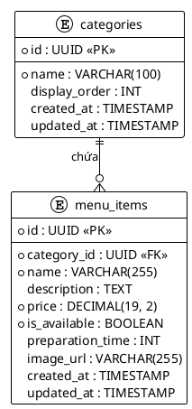

# Database Schema: Menu Service

Tài liệu này đặc tả cấu trúc cơ sở dữ liệu cho **Menu Service** thuộc hệ thống IRMS.

## 1. Sơ đồ thực thể (ERD)

## 2. Đặc tả các bảng (Data Dictionary)

### 2.1. Bảng `categories` (Danh mục)
Lưu trữ các nhóm món ăn (ví dụ: Khai vị, Món chính, Tráng miệng, Đồ uống).

| Tên trường | Kiểu dữ liệu | Ràng buộc | Mô tả |
|:--- |:--- |:--- |:--- |
| `id` | UUID | PRIMARY KEY | Khóa chính (khuyên dùng UUID cho hệ thống phân tán). |
| `name` | VARCHAR(100) | NOT NULL | Tên danh mục món ăn. |
| `display_order`| INT | DEFAULT 0 | Thứ tự hiển thị trên Menu (số nhỏ hiện trước). |
| `created_at` | TIMESTAMP | NOT NULL | Thời điểm tạo bản ghi. |
| `updated_at` | TIMESTAMP | NOT NULL | Thời điểm cập nhật cuối cùng. |

### 2.2. Bảng `menu_items` (Món ăn/Đồ uống)
Lưu trữ thông tin chi tiết của từng món ăn cụ thể.

| Tên trường | Kiểu dữ liệu | Ràng buộc | Mô tả |
|:--- |:--- |:--- |:--- |
| `id` | UUID | PRIMARY KEY | Khóa chính. |
| `category_id` | UUID | FOREIGN KEY | Liên kết tới bảng `categories`. |
| `name` | VARCHAR(255) | NOT NULL | Tên món ăn. |
| `description` | TEXT | | Mô tả chi tiết món ăn (thành phần, cách chế biến). |
| `price` | DECIMAL(19,2) | NOT NULL | Giá bán (Sử dụng Decimal để tránh sai số tiền tệ). |
| `is_available` | BOOLEAN | DEFAULT TRUE | Trạng thái còn hàng (TRUE) hoặc hết hàng (FALSE). |
| `preparation_time`| INT | | Thời gian chế biến dự kiến (tính bằng phút). |
| `image_url` | VARCHAR(255) | | Đường dẫn đến hình ảnh minh họa món ăn. |

## 3. Chiến lược Indexing
Để tối ưu hóa hiệu năng truy vấn, các Index sau sẽ được áp dụng:
- `idx_menu_items_category`: Tìm kiếm nhanh các món theo danh mục.
- `idx_menu_items_availability`: Lọc nhanh các món đang sẵn sàng phục vụ.
- `idx_categories_name`: Tìm kiếm danh mục theo tên.

## 4. Ghi chú thiết kế
- **UUID:** Sử dụng UUID thay vì ID tự tăng (Long/BigInt) để tránh xung đột dữ liệu khi mở rộng hệ thống sang nhiều server hoặc khi đồng bộ dữ liệu.
- **Price:** Luôn dùng `DECIMAL` hoặc `NUMERIC` cho tiền tệ, tuyệt đối không dùng `FLOAT` hay `DOUBLE`.
- **Soft Delete:** Trong tương lai có thể thêm trường `is_deleted` thay vì xóa cứng dữ liệu để giữ lại lịch sử báo cáo.
