# BÁO CÁO BÀI TẬP LỚN: KIẾN TRÚC PHẦN MỀM

## Hệ thống Quản lý Nhà hàng Thông minh (Intelligent Restaurant Management System - IRMS)

---

# TASK 1: THIẾT KẾ KIẾN TRÚC PHẦN MỀM

## 1. Mô tả chi tiết ngữ cảnh hệ thống IRMS

### 1.1. Giới thiệu tổng quan

Hệ thống Quản lý Nhà hàng Thông minh (IRMS - Intelligent Restaurant Management System) là một ứng dụng phần mềm được thiết kế nhằm tối ưu hóa và tự động hóa các hoạt động cốt lõi của nhà hàng. Hệ thống dựa trên giao diện số hóa, cơ sở dữ liệu dùng chung và logic xử lý bằng phần mềm để quản lý các hoạt động như: duyệt thực đơn, đặt món, quy trình chuẩn bị thức ăn, quản lý trạng thái bàn và cập nhật tồn kho.

IRMS đóng vai trò là xương sống kỹ thuật số trung tâm, hỗ trợ vận hành nhà hàng một cách nhất quán trên nhiều mô hình dịch vụ khác nhau.

### 1.2. Mục tiêu của hệ thống

- **Tối ưu hóa quy trình vận hành**: Đảm bảo sự phối hợp trơn tru giữa nhân viên phục vụ (front-of-house), đội ngũ bếp (kitchen teams) và ban quản lý.
- **Nâng cao hiệu quả phục vụ**: Giảm thiểu độ trễ và lỗi trong quá trình đặt món và phục vụ.
- **Hỗ trợ quy trình làm việc động**: Thích ứng với các điều kiện phục vụ khác nhau như giờ cao điểm hoặc đơn hàng nhóm lớn.
- **Cung cấp công cụ quản lý**: Theo dõi chỉ số hiệu suất, lên lịch nhân viên, cập nhật thực đơn và phân tích xu hướng doanh thu.

### 1.3. Phạm vi hệ thống (Scope)

#### 1.3.1. Đặt món số & Quản lý thực đơn (Digital Ordering & Menu Management)
- Nhân viên sử dụng máy tính bảng hoặc thiết bị đầu cuối để nhận đơn nhanh chóng và chính xác.
- Thực đơn có thể được cập nhật theo thời gian thực (ví dụ: đánh dấu món hết).
- Đơn hàng bao gồm hướng dẫn đặc biệt, ghi chú dị ứng, lựa chọn combo và tùy chỉnh.

#### 1.3.2. Hiển thị đơn bếp & Điều phối quy trình (Kitchen Order Display & Workflow Coordination)
- Đơn hàng được tự động chuyển từ thiết bị đầu cuối sang Hệ thống Hiển thị Bếp (KDS - Kitchen Display System).
- KDS tổ chức đơn theo thời gian chuẩn bị, loại món và trạm làm việc (nướng, chiên, tráng miệng).
- Cảnh báo trực quan thông báo cho đầu bếp khi món sắp đến hạn hoặc có đơn mới.
- Nhân viên bếp có thể cập nhật tiến độ (Đã bắt đầu, Đang nấu, Sẵn sàng phục vụ).

#### 1.3.3. Quản lý bàn & Đặt chỗ (Table & Reservation Management)
- Quản lý sơ đồ chỗ ngồi số hóa, theo dõi bàn trống/đang sử dụng, ước tính thời gian chờ.
- Nhân viên có thể giám sát trạng thái đơn hàng, thời gian phục vụ và trạng thái thanh toán của từng bàn.
- Module đặt chỗ hỗ trợ đặt lịch, danh sách chờ và thông báo cho khách hàng.

#### 1.3.4. Thanh toán & Hóa đơn (Billing, Payments & Receipts)
- Tích hợp hóa đơn bao gồm thức ăn, đồ uống, phí dịch vụ và khuyến mãi.
- Hỗ trợ thanh toán qua tiền mặt, thẻ hoặc ví điện tử.
- Cung cấp tùy chọn chia hóa đơn và quản lý tiền tip.

#### 1.3.5. Giám sát tồn kho (Inventory Monitoring)
- Nhân viên cập nhật thủ công việc sử dụng nguyên liệu sau khi chuẩn bị hoặc phục vụ.
- Cảnh báo khi tồn kho dưới ngưỡng đã định.
- Lịch sử sử dụng giúp dự đoán số lượng đặt hàng lại và quản lý lãng phí.

#### 1.3.6. Phân tích & Báo cáo (Analytics & Reports)
- Báo cáo doanh thu hiển thị giờ cao điểm, món bán chạy và hiệu suất doanh thu.
- Phân tích vận hành làm nổi bật độ trễ, nút thắt cổ chai trong bếp và hiệu suất nhân viên.
- Quản lý có thể xuất báo cáo cho kế toán, lập kế hoạch hoặc đánh giá hiệu suất.

#### 1.3.7. Công cụ quản trị (Administrative Tools)
- Kiểm soát truy cập dựa trên vai trò (Role-based access control) cho quản lý, nhân viên phục vụ, đầu bếp và thu ngân.
- Cấu hình thực đơn, cập nhật giá và quản lý chiến dịch khuyến mãi tập trung.
- Nhật ký kiểm toán (Audit logs) theo dõi các hành động quan trọng như hoàn tiền hoặc hủy đơn.

### 1.4. Yêu cầu chức năng (Functional Requirements)

| ID | Yêu cầu chức năng | Mô tả |
|----|-------------------|-------|
| FR01 | Quản lý đơn hàng | Tạo, sửa, hủy đơn hàng với các tùy chỉnh và ghi chú đặc biệt |
| FR02 | Quản lý thực đơn | Thêm, sửa, xóa món; cập nhật giá; đánh dấu món hết |
| FR03 | Hiển thị đơn bếp (KDS) | Hiển thị đơn hàng theo thứ tự ưu tiên, trạm làm việc và tiến độ |
| FR04 | Quản lý bàn | Theo dõi trạng thái bàn, gán khách, ước tính thời gian |
| FR05 | Đặt chỗ trước | Cho phép đặt bàn trước, quản lý danh sách chờ |
| FR06 | Thanh toán | Xử lý thanh toán đa phương thức, chia hóa đơn, quản lý tip |
| FR07 | Quản lý tồn kho | Cập nhật tồn kho, cảnh báo ngưỡng, theo dõi sử dụng |
| FR08 | Báo cáo & Phân tích | Tạo báo cáo doanh thu, hiệu suất vận hành |
| FR09 | Quản lý người dùng | Phân quyền theo vai trò, xác thực người dùng |
| FR10 | Nhật ký kiểm toán | Ghi lại các hành động quan trọng trong hệ thống |

### 1.5. Yêu cầu phi chức năng (Non-functional Requirements / Architecture Characteristics)

Dựa trên việc phân tích ngữ cảnh domain và các yêu cầu của hệ thống IRMS, các đặc tính kiến trúc (Architecture Characteristics) quan trọng được xác định như sau:

#### 1.5.1. Đặc tính vận hành (Operational Characteristics)

| Đặc tính | Mức độ | Lý do |
|----------|--------|-------|
| **Availability (Khả dụng)** | Cao | Nhà hàng hoạt động liên tục; hệ thống không được downtime trong giờ phục vụ |
| **Performance (Hiệu năng)** | Cao | Yêu cầu phản hồi thời gian thực cho KDS và đặt món; giờ cao điểm cần xử lý nhanh |
| **Reliability (Độ tin cậy)** | Cao | Đơn hàng và thanh toán không được mất mát hoặc sai lệch |
| **Scalability (Khả năng mở rộng)** | Trung bình | Hỗ trợ mở rộng khi nhà hàng phát triển hoặc có chuỗi |

#### 1.5.2. Đặc tính cấu trúc (Structural Characteristics)

| Đặc tính | Mức độ | Lý do |
|----------|--------|-------|
| **Maintainability (Khả năng bảo trì)** | Cao | Thực đơn, giá cả, quy trình thay đổi thường xuyên |
| **Modularity (Tính mô-đun)** | Cao | Các module độc lập: đặt món, bếp, thanh toán, tồn kho |
| **Extensibility (Khả năng mở rộng)** | Cao | Cần dễ dàng thêm tính năng mới (delivery, loyalty program) |
| **Testability (Khả năng kiểm thử)** | Cao | Cần kiểm thử độc lập từng module nghiệp vụ |

#### 1.5.3. Đặc tính xuyên suốt (Cross-cutting Characteristics)

| Đặc tính | Mức độ | Lý do |
|----------|--------|-------|
| **Security (Bảo mật)** | Cao | Xử lý thanh toán, dữ liệu khách hàng, phân quyền nhân viên |
| **Usability (Tính dễ sử dụng)** | Cao | Nhân viên cần thao tác nhanh, giao diện trực quan |
| **Auditability (Khả năng kiểm toán)** | Trung bình-Cao | Cần theo dõi hoàn tiền, hủy đơn, thay đổi giá |

### 1.6. Các bên liên quan (Stakeholders)

| Bên liên quan | Vai trò | Tương tác với hệ thống |
|---------------|---------|------------------------|
| **Nhân viên phục vụ (Servers)** | Người dùng chính | Đặt món, quản lý bàn, thanh toán |
| **Đầu bếp (Kitchen Staff)** | Người dùng | Nhận đơn qua KDS, cập nhật tiến độ |
| **Thu ngân (Cashiers)** | Người dùng | Xử lý thanh toán, in hóa đơn |
| **Quản lý (Managers)** | Quản trị viên | Cấu hình thực đơn, xem báo cáo, quản lý nhân viên |
| **Tiếp tân (Hosts)** | Người dùng | Quản lý đặt chỗ, sơ đồ bàn |
| **Khách hàng (Customers)** | Người dùng gián tiếp | Hưởng lợi từ dịch vụ nhanh và chính xác |

---

## 2. So sánh và lựa chọn phong cách kiến trúc phù hợp

### 2.1. Tổng quan các phong cách kiến trúc

Dựa trên kiến thức từ chương 5 (Architectural Styles), có hai loại kiến trúc chính:
- **Monolithic (Đơn khối)**: Toàn bộ mã nguồn được triển khai như một đơn vị duy nhất
- **Distributed (Phân tán)**: Nhiều đơn vị triển khai kết nối qua giao thức truy cập từ xa

### 2.2. Phân tích các phong cách kiến trúc

#### 2.2.1. Layered Architecture (Kiến trúc phân tầng)

**Mô tả**: Tổ chức các component thành các tầng logic ngang (Presentation, Business, Persistence, Database). Mỗi tầng đảm nhận vai trò riêng biệt.

| Tiêu chí | Đánh giá | Ghi chú |
|----------|----------|---------|
| Simplicity (Đơn giản) | ⭐⭐⭐⭐⭐ | Dễ hiểu, phổ biến |
| Cost (Chi phí) | ⭐⭐⭐⭐⭐ | Thấp, không cần hạ tầng phức tạp |
| Deployability | ⭐⭐ | Phải triển khai toàn bộ |
| Modularity | ⭐⭐⭐ | Phân tách kỹ thuật, không theo domain |
| Scalability | ⭐ | Khó scale từng phần |
| Fault Tolerance | ⭐ | Lỗi một phần ảnh hưởng toàn bộ |

**Phù hợp với IRMS?** Phù hợp một phần. Đơn giản nhưng không hỗ trợ tốt việc mở rộng và tách biệt domain.

#### 2.2.2. Pipeline Architecture (Kiến trúc ống dẫn)

**Mô tả**: Dữ liệu di chuyển qua các filter (Producer → Transformer → Tester → Consumer) thông qua các pipe một chiều.

| Tiêu chí | Đánh giá | Ghi chú |
|----------|----------|---------|
| Simplicity | ⭐⭐⭐⭐ | Đơn giản cho xử lý tuần tự |
| Modularity | ⭐⭐⭐ | Filter độc lập |
| Performance | ⭐⭐⭐ | Tốt cho xử lý batch |

**Phù hợp với IRMS?** **Không phù hợp**. Pipeline phù hợp cho xử lý dữ liệu tuần tự (ETL, streaming), không phù hợp với hệ thống tương tác thời gian thực như IRMS.

#### 2.2.3. Microkernel Architecture (Kiến trúc vi nhân)

**Mô tả**: Gồm Core System (hệ thống lõi) và Plug-in Components (thành phần cắm vào). Cung cấp khả năng mở rộng và cô lập tính năng.

| Tiêu chí | Đánh giá | Ghi chú |
|----------|----------|---------|
| Extensibility | ⭐⭐⭐⭐⭐ | Dễ thêm plugin mới |
| Maintainability | ⭐⭐⭐⭐ | Plugin độc lập, dễ bảo trì |
| Testability | ⭐⭐⭐⭐ | Test từng plugin riêng |
| Scalability | ⭐⭐ | Vẫn là monolithic |
| Fault Tolerance | ⭐⭐ | Plugin lỗi có thể ảnh hưởng core |

**Phù hợp với IRMS?** Phù hợp một phần. Tốt cho khả năng mở rộng tính năng (thêm module khuyến mãi, loyalty) nhưng vẫn có hạn chế về scale.

#### 2.2.4. Service-Based Architecture (Kiến trúc dựa trên dịch vụ)

**Mô tả**: Kiến trúc phân tán với các domain service coarse-grained (hạt thô), cơ sở dữ liệu tập trung hoặc được phân vùng. Số lượng service thường từ 4-12 (trung bình 7 service).

| Tiêu chí | Đánh giá | Ghi chú |
|----------|----------|---------|
| Domain Partitioning | ⭐⭐⭐⭐⭐ | Phân chia theo domain nghiệp vụ |
| Agility | ⭐⭐⭐⭐ | Thay đổi nhanh chóng |
| Deployability | ⭐⭐⭐⭐ | Deploy từng service độc lập |
| Testability | ⭐⭐⭐⭐ | Test từng service riêng |
| Fault Tolerance | ⭐⭐⭐⭐ | Service lỗi không ảnh hưởng toàn bộ |
| Scalability | ⭐⭐⭐ | Scale được nhưng hạt thô |
| Simplicity/Cost | ⭐⭐⭐⭐ | Đơn giản hơn microservices |
| Data Integrity (ACID) | ⭐⭐⭐⭐⭐ | Hỗ trợ ACID transaction |

**Phù hợp với IRMS?** **Rất phù hợp**. Cân bằng tốt giữa modularity và độ phức tạp.

#### 2.2.5. Microservices Architecture (Kiến trúc vi dịch vụ)

**Mô tả**: Các service đơn chức năng, fine-grained (hạt mịn), mỗi service sở hữu dữ liệu riêng (bounded context). Dựa trên Domain-Driven Design (DDD).

| Tiêu chí | Đánh giá | Ghi chú |
|----------|----------|---------|
| Scalability | ⭐⭐⭐⭐⭐ | Scale từng service độc lập |
| Deployability | ⭐⭐⭐⭐⭐ | CI/CD từng service |
| Fault Tolerance | ⭐⭐⭐⭐⭐ | Cô lập lỗi tốt |
| Complexity | ⭐ | Rất phức tạp |
| Cost | ⭐⭐ | Chi phí hạ tầng cao |
| Data Integrity | ⭐⭐ | BASE thay vì ACID, eventual consistency |
| Performance | ⭐⭐ | Network latency giữa services |

**Phù hợp với IRMS?** **Quá phức tạp**. IRMS là hệ thống cho một/vài nhà hàng, không cần mức độ decoupling cao của microservices. Chi phí và độ phức tạp không hợp lý.

#### 2.2.6. Event-Driven Architecture (Kiến trúc hướng sự kiện)

**Mô tả**: Xử lý sự kiện bất đồng bộ, có hai topology chính: Mediator (có điều phối trung tâm) và Broker (không có điều phối trung tâm).

| Tiêu chí | Đánh giá | Ghi chú |
|----------|----------|---------|
| Performance | ⭐⭐⭐⭐⭐ | Xử lý bất đồng bộ, phản hồi nhanh |
| Scalability | ⭐⭐⭐⭐⭐ | Dễ scale |
| Responsiveness | ⭐⭐⭐⭐⭐ | Fire-and-forget |
| Complexity | ⭐⭐ | Phức tạp, khó debug |
| Error Handling | ⭐⭐ | Xử lý lỗi trong async khó khăn |
| Data Loss Risk | ⭐⭐ | Rủi ro mất dữ liệu trong async |

**Phù hợp với IRMS?** **Phù hợp một phần**. Có thể kết hợp cho một số workflow như thông báo KDS, nhưng không nên là kiến trúc chính do độ phức tạp và rủi ro với transaction thanh toán.

### 2.3. Bảng so sánh tổng hợp

| Tiêu chí | Layered | Pipeline | Microkernel | Service-Based | Microservices | Event-Driven |
|----------|---------|----------|-------------|---------------|---------------|--------------|
| **Modularity** | ⭐⭐⭐ | ⭐⭐⭐ | ⭐⭐⭐⭐ | ⭐⭐⭐⭐ | ⭐⭐⭐⭐⭐ | ⭐⭐⭐⭐ |
| **Extensibility** | ⭐⭐ | ⭐⭐ | ⭐⭐⭐⭐⭐ | ⭐⭐⭐⭐ | ⭐⭐⭐⭐⭐ | ⭐⭐⭐⭐ |
| **Maintainability** | ⭐⭐⭐ | ⭐⭐⭐ | ⭐⭐⭐⭐ | ⭐⭐⭐⭐ | ⭐⭐⭐ | ⭐⭐⭐ |
| **Testability** | ⭐⭐⭐ | ⭐⭐⭐ | ⭐⭐⭐⭐ | ⭐⭐⭐⭐ | ⭐⭐⭐⭐ | ⭐⭐⭐ |
| **Scalability** | ⭐ | ⭐⭐ | ⭐⭐ | ⭐⭐⭐ | ⭐⭐⭐⭐⭐ | ⭐⭐⭐⭐⭐ |
| **Fault Tolerance** | ⭐ | ⭐ | ⭐⭐ | ⭐⭐⭐⭐ | ⭐⭐⭐⭐⭐ | ⭐⭐⭐⭐ |
| **Simplicity** | ⭐⭐⭐⭐⭐ | ⭐⭐⭐⭐ | ⭐⭐⭐⭐ | ⭐⭐⭐⭐ | ⭐⭐ | ⭐⭐ |
| **Cost** | ⭐⭐⭐⭐⭐ | ⭐⭐⭐⭐ | ⭐⭐⭐⭐ | ⭐⭐⭐⭐ | ⭐⭐ | ⭐⭐⭐ |
| **ACID Support** | ⭐⭐⭐⭐⭐ | ⭐⭐⭐⭐ | ⭐⭐⭐⭐⭐ | ⭐⭐⭐⭐⭐ | ⭐⭐ | ⭐⭐ |

### 2.4. Lựa chọn kiến trúc cho IRMS

#### 2.4.1. Kiến trúc được chọn: **Service-Based Architecture**

Sau khi phân tích các yêu cầu của IRMS và so sánh với các phong cách kiến trúc, **Service-Based Architecture** được chọn là kiến trúc phù hợp nhất cho hệ thống IRMS.

#### 2.4.2. Lý do lựa chọn

**1. Phù hợp với Domain Partitioning (Phân vùng theo domain)**

IRMS có các domain nghiệp vụ rõ ràng và tương đối độc lập:
- **Order Service**: Quản lý đặt món
- **Kitchen Service**: Quản lý quy trình bếp (KDS)
- **Table Service**: Quản lý bàn và đặt chỗ
- **Payment Service**: Quản lý thanh toán
- **Inventory Service**: Quản lý tồn kho
- **Reporting Service**: Báo cáo và phân tích
- **Admin Service**: Quản trị hệ thống

Service-Based Architecture cho phép phân chia hệ thống theo các domain này (domain-partitioned), phù hợp với Domain-Driven Design.

**2. Hỗ trợ ACID Transaction**

Hệ thống nhà hàng yêu cầu tính toàn vẹn dữ liệu cao:
- Đơn hàng không được mất mát
- Thanh toán phải chính xác
- Tồn kho phải đồng bộ

Service-Based Architecture sử dụng các service hạt thô (coarse-grained) với cơ sở dữ liệu tập trung hoặc được phân vùng, cho phép sử dụng **ACID transaction** thay vì BASE (eventual consistency) như trong Microservices.

**3. Cân bằng giữa Modularity và Complexity**

- Không quá đơn giản như Layered Architecture (khó mở rộng, khó scale)
- Không quá phức tạp như Microservices (chi phí cao, eventual consistency)
- Số lượng service vừa phải (4-12 services) phù hợp với quy mô IRMS

**4. Fault Tolerance và Deployability**

- Mỗi domain service có thể được deploy độc lập
- Lỗi ở một service (ví dụ: Reporting) không ảnh hưởng đến các service quan trọng khác (Order, Payment)
- Dễ dàng maintain và update từng service

**5. Chi phí và độ phức tạp hợp lý**

Theo slide: *"Service-based architecture is considered one of the most practical architecture styles, mostly due to its architectural flexibility. It doesn't have the same level of complexity and cost as other distributed architectures, such as microservices."*

#### 2.4.3. Kết hợp với các pattern khác

Để tận dụng ưu điểm của các kiến trúc khác, IRMS có thể kết hợp:

1. **Microkernel Pattern** cho Admin Service:
   - Core system: Cấu hình cơ bản
   - Plugins: Các module khuyến mãi, loyalty program, tích hợp bên thứ ba

2. **Event-Driven elements** cho Kitchen Display:
   - Đơn hàng mới → Event → KDS (thông báo real-time)
   - Cập nhật trạng thái món → Event → Server notification

3. **Layered Architecture** bên trong mỗi service:
   - Mỗi domain service có thể được tổ chức theo layers (Presentation, Business, Persistence)

#### 2.4.4. Topology đề xuất cho IRMS

```
┌─────────────────────────────────────────────────────────────────┐
│                      User Interfaces                            │
│  ┌─────────┐  ┌─────────┐  ┌─────────┐  ┌─────────┐            │
│  │ POS UI  │  │ KDS UI  │  │ Admin UI│  │ Host UI │            │
│  └────┬────┘  └────┬────┘  └────┬────┘  └────┬────┘            │
└───────┼────────────┼────────────┼────────────┼──────────────────┘
        │            │            │            │
        ▼            ▼            ▼            ▼
┌─────────────────────────────────────────────────────────────────┐
│                      API Gateway Layer                          │
└─────────────────────────────────────────────────────────────────┘
        │            │            │            │
        ▼            ▼            ▼            ▼
┌─────────────────────────────────────────────────────────────────┐
│                     Domain Services                              │
│  ┌─────────┐  ┌─────────┐  ┌─────────┐  ┌─────────┐            │
│  │  Order  │  │ Kitchen │  │  Table  │  │ Payment │            │
│  │ Service │  │ Service │  │ Service │  │ Service │            │
│  └─────────┘  └─────────┘  └─────────┘  └─────────┘            │
│  ┌─────────┐  ┌─────────┐  ┌─────────┐                         │
│  │Inventory│  │Reporting│  │  Admin  │                         │
│  │ Service │  │ Service │  │ Service │                         │
│  └─────────┘  └─────────┘  └─────────┘                         │
└─────────────────────────────────────────────────────────────────┘
        │            │            │            │
        ▼            ▼            ▼            ▼
┌─────────────────────────────────────────────────────────────────┐
│                    Shared Database Layer                        │
│  (với logical partitioning theo domain)                         │
└─────────────────────────────────────────────────────────────────┘
```

---

## 3. Thiết kế kiến trúc phần mềm cho IRMS

Phần này trình bày kiến trúc phần mềm của hệ thống IRMS thông qua ba góc nhìn (views) theo phương pháp "Views and Beyond":

1. **Module View**: Thể hiện cấu trúc mã nguồn ở mức thiết kế (design-time)
2. **Component-and-Connector View**: Thể hiện các thành phần runtime và tương tác giữa chúng
3. **Allocation View**: Thể hiện việc ánh xạ phần mềm lên phần cứng và môi trường triển khai

### 3.1. Module View (Góc nhìn Module)

#### 3.1.1. Giới thiệu

Module View thể hiện cách hệ thống được phân rã thành các đơn vị mã nguồn (modules) và mối quan hệ giữa chúng. Đây là góc nhìn quan trọng nhất ở giai đoạn thiết kế vì nó cho thấy:
- **Decomposition (Phân rã)**: Cách hệ thống được chia thành các module nhỏ hơn
- **Uses relation (Quan hệ sử dụng)**: Module nào sử dụng module nào
- **Layered structure (Cấu trúc phân tầng)**: Tổ chức các module theo layers

Theo kiến thức về **Modularity** (Chapter 3), một module tốt cần có:
- **High Cohesion**: Các thành phần trong module liên quan chặt chẽ với nhau
- **Low Coupling**: Giảm thiểu sự phụ thuộc giữa các module

#### 3.1.2. Phân rã hệ thống theo Domain Services

Dựa trên Service-Based Architecture đã chọn, IRMS được phân rã thành **7 Domain Services** chính:

| Module | Trách nhiệm | Cohesion Type |
|--------|-------------|---------------|
| **Order Module** | Quản lý vòng đời đơn hàng (tạo, sửa, hủy, trạng thái) | Functional Cohesion |
| **Menu Module** | Quản lý thực đơn, món ăn, giá cả, tùy chỉnh | Functional Cohesion |
| **Kitchen Module** | Điều phối quy trình bếp, KDS, ưu tiên món | Functional Cohesion |
| **Table Module** | Quản lý bàn, đặt chỗ, sơ đồ nhà hàng | Functional Cohesion |
| **Payment Module** | Xử lý thanh toán, hóa đơn, hoàn tiền | Functional Cohesion |
| **Inventory Module** | Theo dõi tồn kho, cảnh báo, lịch sử sử dụng | Functional Cohesion |
| **Reporting Module** | Tạo báo cáo, phân tích dữ liệu, xuất file | Functional Cohesion |
| **Admin Module** | Quản lý người dùng, phân quyền, cấu hình | Functional Cohesion |

#### 3.1.3. Biểu đồ Module View - Decomposition

```plantuml
@startuml IRMS_Module_Decomposition
!theme plain
skinparam packageStyle rectangle
skinparam linetype ortho

title IRMS - Module View: Decomposition Structure

package "IRMS System" {

    package "Presentation Layer" <<Frame>> #LightBlue {
        package "UI Modules" {
            [POS UI Module] as POS_UI
            [KDS UI Module] as KDS_UI
            [Admin UI Module] as Admin_UI
            [Host UI Module] as Host_UI
        }
    }

    package "API Gateway Layer" <<Frame>> #LightGreen {
        [API Gateway Module] as API_GW
        [Authentication Module] as Auth
        [Request Router Module] as Router
    }

    package "Business Logic Layer" <<Frame>> #LightYellow {
        package "Order Domain" {
            [Order Service Module] as Order_Svc
            [Order Validator] as Order_Val
            [Order State Machine] as Order_SM
        }

        package "Menu Domain" {
            [Menu Service Module] as Menu_Svc
            [Menu Catalog] as Menu_Cat
            [Price Calculator] as Price_Calc
        }

        package "Kitchen Domain" {
            [Kitchen Service Module] as Kitchen_Svc
            [KDS Controller] as KDS_Ctrl
            [Order Prioritizer] as Order_Prior
            [Station Manager] as Station_Mgr
        }

        package "Table Domain" {
            [Table Service Module] as Table_Svc
            [Reservation Manager] as Res_Mgr
            [Floor Plan Manager] as Floor_Mgr
        }

        package "Payment Domain" {
            [Payment Service Module] as Payment_Svc
            [Payment Processor] as Pay_Proc
            [Invoice Generator] as Invoice_Gen
            [Refund Handler] as Refund_Hdlr
        }

        package "Inventory Domain" {
            [Inventory Service Module] as Inv_Svc
            [Stock Tracker] as Stock_Track
            [Alert Manager] as Alert_Mgr
        }

        package "Reporting Domain" {
            [Reporting Service Module] as Report_Svc
            [Report Generator] as Report_Gen
            [Analytics Engine] as Analytics
        }

        package "Admin Domain" {
            [Admin Service Module] as Admin_Svc
            [User Manager] as User_Mgr
            [Role Manager] as Role_Mgr
            [Audit Logger] as Audit_Log
        }
    }

    package "Data Access Layer" <<Frame>> #LightPink {
        [Order Repository] as Order_Repo
        [Menu Repository] as Menu_Repo
        [Kitchen Repository] as Kitchen_Repo
        [Table Repository] as Table_Repo
        [Payment Repository] as Payment_Repo
        [Inventory Repository] as Inv_Repo
        [Report Repository] as Report_Repo
        [User Repository] as User_Repo
    }

    package "Shared/Common Layer" <<Frame>> #LightGray {
        [Domain Models] as Models
        [Utilities] as Utils
        [Exceptions] as Exceptions
        [Constants] as Constants
    }
}

' Layer relationships (uses)
POS_UI --> API_GW
KDS_UI --> API_GW
Admin_UI --> API_GW
Host_UI --> API_GW

API_GW --> Auth
API_GW --> Router

Router --> Order_Svc
Router --> Menu_Svc
Router --> Kitchen_Svc
Router --> Table_Svc
Router --> Payment_Svc
Router --> Inv_Svc
Router --> Report_Svc
Router --> Admin_Svc

' Service to Repository
Order_Svc --> Order_Repo
Menu_Svc --> Menu_Repo
Kitchen_Svc --> Kitchen_Repo
Table_Svc --> Table_Repo
Payment_Svc --> Payment_Repo
Inv_Svc --> Inv_Repo
Report_Svc --> Report_Repo
Admin_Svc --> User_Repo

' Shared dependencies
Order_Svc --> Models
Menu_Svc --> Models
Kitchen_Svc --> Models
Payment_Svc --> Models

@enduml
```

#### 3.1.4. Biểu đồ Module View - Uses Relation

Biểu đồ này thể hiện quan hệ **"uses"** giữa các module - module A "uses" module B nếu A cần B để hoàn thành chức năng của mình.

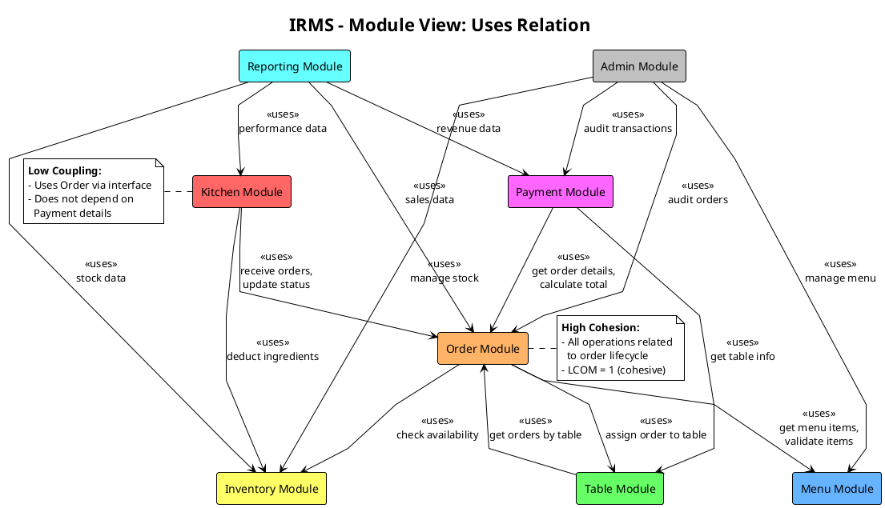

#### 3.1.5. Biểu đồ Module View - Layered Structure

Theo kiến thức về **Layered Architecture** (Chapter 5), mỗi Domain Service bên trong được tổ chức theo layers với nguyên tắc **closed layers** để duy trì **layers of isolation**.

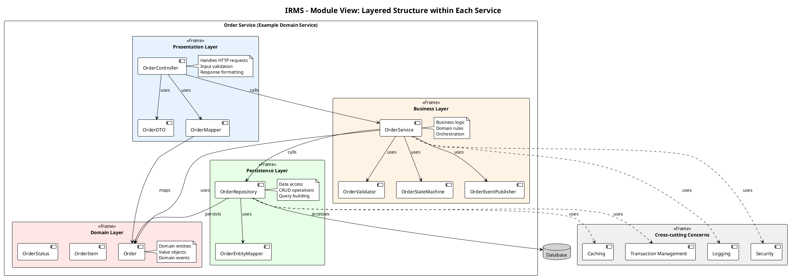

#### 3.1.6. Mô tả chi tiết các Module chính

##### A. Order Module

| Thành phần | Trách nhiệm |
|------------|-------------|
| `OrderController` | Xử lý HTTP requests (REST API endpoints) |
| `OrderService` | Business logic: tạo, cập nhật, hủy đơn hàng |
| `OrderValidator` | Kiểm tra tính hợp lệ của đơn hàng |
| `OrderStateMachine` | Quản lý trạng thái đơn hàng (PENDING → CONFIRMED → PREPARING → READY → SERVED → PAID) |
| `OrderRepository` | Thao tác CRUD với database |
| `Order`, `OrderItem` | Domain entities |

##### B. Kitchen Module

| Thành phần | Trách nhiệm |
|------------|-------------|
| `KitchenController` | API endpoints cho KDS |
| `KitchenService` | Logic điều phối bếp |
| `KDSController` | Điều khiển màn hình hiển thị bếp |
| `OrderPrioritizer` | Sắp xếp thứ tự ưu tiên món |
| `StationManager` | Phân công món đến các trạm (grill, fryer, dessert) |
| `KitchenRepository` | Lưu trữ trạng thái bếp |

##### C. Payment Module

| Thành phần | Trách nhiệm |
|------------|-------------|
| `PaymentController` | API endpoints thanh toán |
| `PaymentService` | Logic xử lý thanh toán |
| `PaymentProcessor` | Tích hợp các phương thức thanh toán (Cash, Card, Digital Wallet) |
| `InvoiceGenerator` | Tạo hóa đơn |
| `RefundHandler` | Xử lý hoàn tiền |
| `PaymentRepository` | Lưu trữ giao dịch |

---

### 3.2. Component-and-Connector View (Góc nhìn Component-Connector)

#### 3.2.1. Giới thiệu

Component-and-Connector (C&C) View thể hiện các **thành phần runtime** của hệ thống và cách chúng **tương tác** với nhau. Khác với Module View (design-time), C&C View tập trung vào:

- **Components**: Các đơn vị thực thi (processes, services, clients, servers, data stores)
- **Connectors**: Cơ chế tương tác (REST API, message queues, database connections)
- **Runtime behavior**: Cách hệ thống hoạt động khi chạy

#### 3.2.2. Component Types trong IRMS

| Component Type | Mô tả | Ví dụ trong IRMS |
|----------------|-------|------------------|
| **Client** | Ứng dụng người dùng | POS App, KDS App, Admin Web |
| **Service** | Domain service độc lập | Order Service, Kitchen Service |
| **Data Store** | Lưu trữ dữ liệu | PostgreSQL Database, Redis Cache |
| **Message Broker** | Truyền tin bất đồng bộ | RabbitMQ (cho KDS notifications) |

#### 3.2.3. Connector Types trong IRMS

| Connector Type | Mô tả | Protocol |
|----------------|-------|----------|
| **REST API** | Giao tiếp đồng bộ giữa client-service và service-service | HTTP/HTTPS, JSON |
| **Database Connection** | Kết nối đến data store | JDBC/Connection Pool |
| **Message Queue** | Giao tiếp bất đồng bộ cho events | AMQP (RabbitMQ) |
| **WebSocket** | Real-time updates cho KDS | WebSocket |

#### 3.2.4. Biểu đồ C&C View - Tổng quan hệ thống

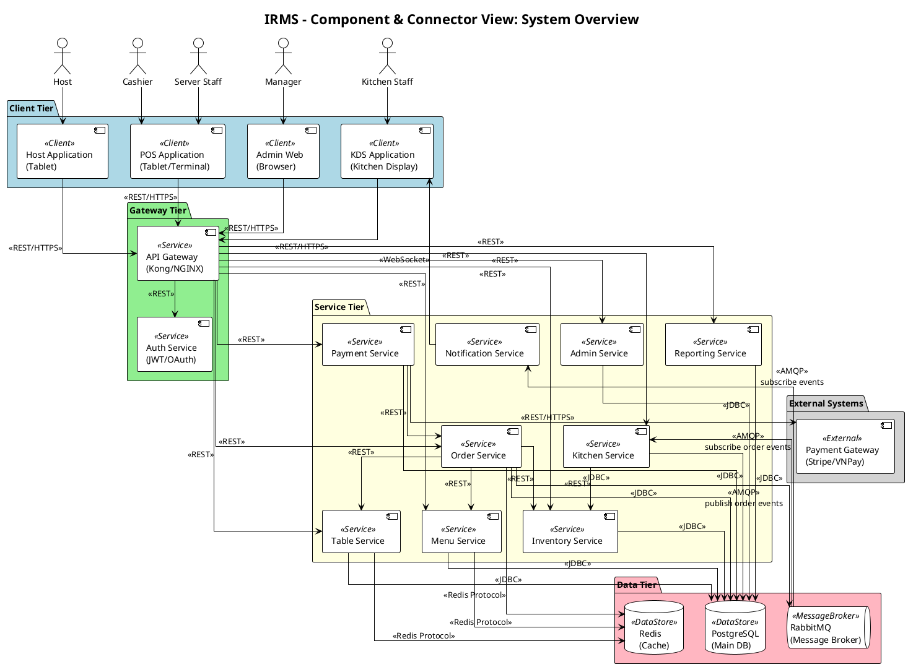

#### 3.2.5. Biểu đồ C&C View - Luồng đặt món (Order Flow)

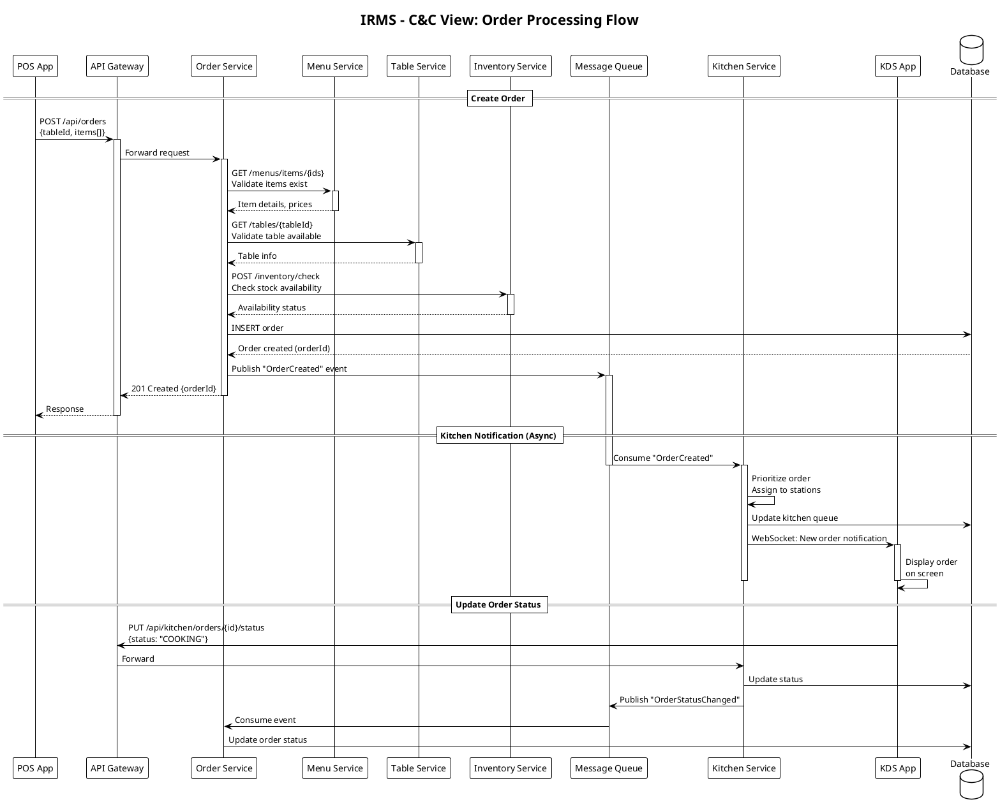

#### 3.2.6. Biểu đồ C&C View - Luồng thanh toán (Payment Flow)

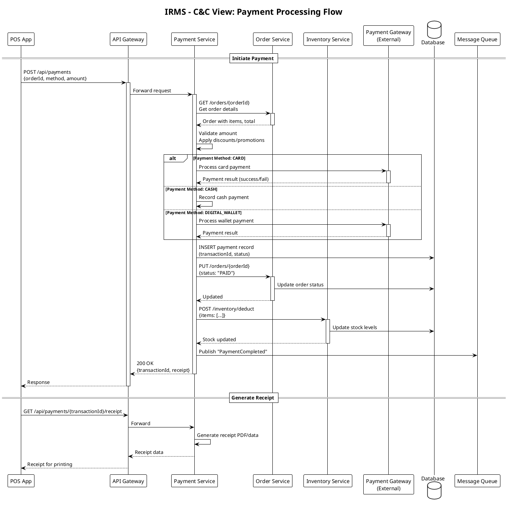

#### 3.2.7. Chi tiết các Connector

##### A. REST API Connector

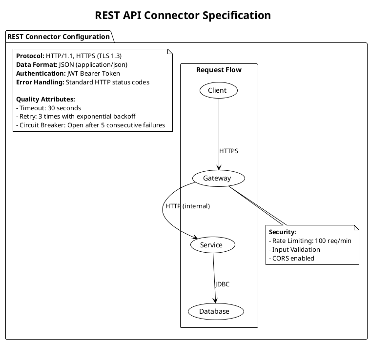

##### B. Message Queue Connector

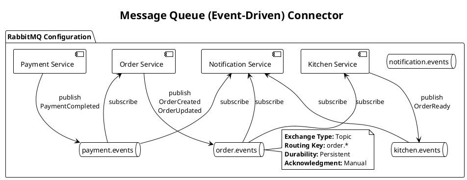

---

### 3.3. Allocation View (Góc nhìn Phân bổ)

#### 3.3.1. Giới thiệu

Allocation View thể hiện cách các thành phần phần mềm được **ánh xạ** lên các phần tử phi phần mềm:
- **Deployment View**: Ánh xạ components lên hardware/infrastructure
- **Implementation View**: Ánh xạ modules lên file system
- **Work Assignment View**: Ánh xạ modules lên development teams

#### 3.3.2. Deployment View - Kiến trúc triển khai

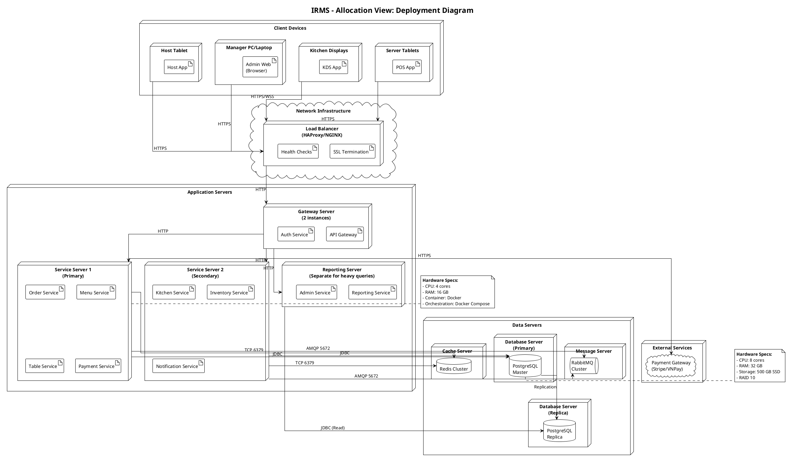

#### 3.3.3. Deployment View - Container Deployment (Docker)

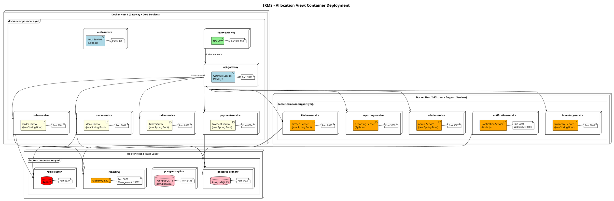

#### 3.3.4. Implementation View - Cấu trúc thư mục dự án

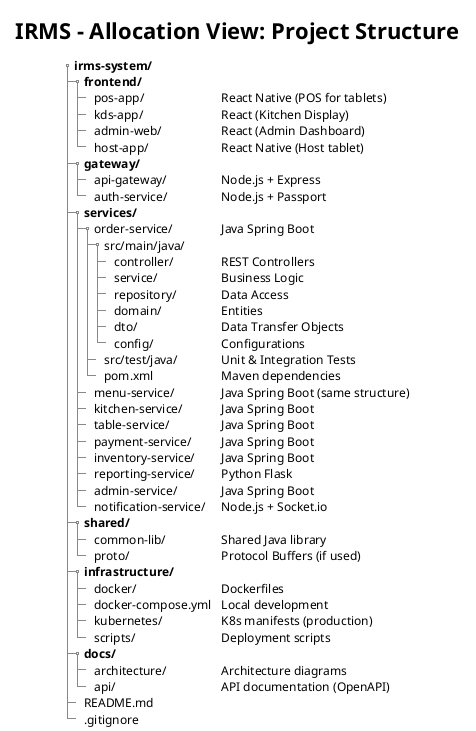

#### 3.3.5. Work Assignment View - Phân công phát triển

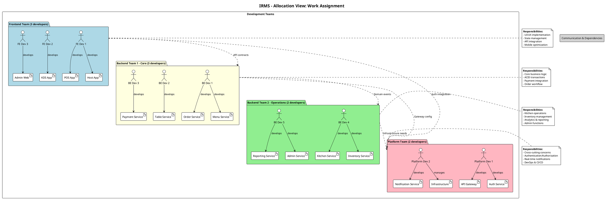

#### 3.3.6. Bảng tổng hợp Hardware Requirements

| Component | CPU | RAM | Storage | Network | Instances |
|-----------|-----|-----|---------|---------|-----------|
| **Load Balancer** | 2 cores | 4 GB | 50 GB SSD | 1 Gbps | 2 (HA) |
| **Gateway Server** | 4 cores | 8 GB | 100 GB SSD | 1 Gbps | 2 |
| **Application Server (Core)** | 4 cores | 16 GB | 100 GB SSD | 1 Gbps | 2 |
| **Application Server (Support)** | 4 cores | 8 GB | 100 GB SSD | 1 Gbps | 1 |
| **Database Server (Primary)** | 8 cores | 32 GB | 500 GB SSD | 1 Gbps | 1 |
| **Database Server (Replica)** | 4 cores | 16 GB | 500 GB SSD | 1 Gbps | 1 |
| **Cache Server (Redis)** | 2 cores | 8 GB | 50 GB SSD | 1 Gbps | 1 |
| **Message Server (RabbitMQ)** | 2 cores | 4 GB | 100 GB SSD | 1 Gbps | 1 |

#### 3.3.7. Environment Configuration

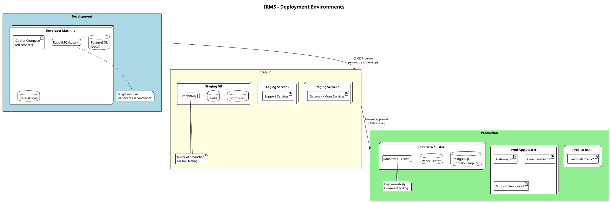

---

## 4. UML Class Diagram cho các module cốt lõi

### 4.1. Giới thiệu

Phần này trình bày biểu đồ lớp UML (UML Class Diagram) cho các module cốt lõi của hệ thống IRMS. Biểu đồ được thiết kế tuân thủ các nguyên lý SOLID và phản ánh kiến trúc Service-Based đã chọn.

Các module cốt lõi bao gồm:
- **Order Module**: Quản lý đơn hàng
- **Menu Module**: Quản lý thực đơn
- **Kitchen Module**: Quản lý quy trình bếp
- **Payment Module**: Quản lý thanh toán

### 4.2. Biểu đồ lớp tổng quan - Core Domain Classes

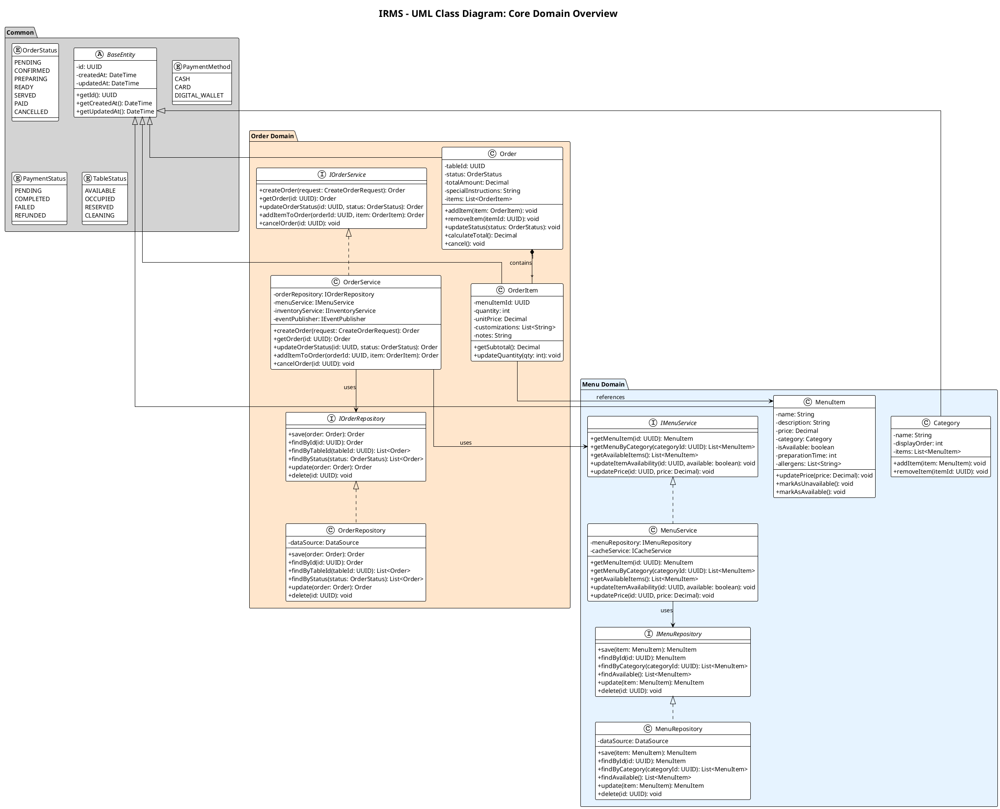

### 4.3. Biểu đồ lớp - Kitchen & Payment Modules

```plantuml
@startuml IRMS_Class_Kitchen_Payment
!theme plain
skinparam classAttributeIconSize 0
skinparam linetype ortho

title IRMS - UML Class Diagram: Kitchen & Payment Modules

' ========== KITCHEN DOMAIN ==========
package "Kitchen Domain" #FFE6E6 {

    enum KitchenOrderStatus {
        QUEUED
        IN_PROGRESS
        READY
        SERVED
    }

    enum Station {
        GRILL
        FRY
        SALAD
        DESSERT
        BEVERAGE
    }

    class KitchenOrder {
        - orderId: UUID
        - status: KitchenOrderStatus
        - priority: int
        - estimatedTime: int
        - assignedStation: Station
        - startedAt: DateTime
        - completedAt: DateTime
        - items: List<KitchenOrderItem>
        + start(): void
        + markReady(): void
        + updatePriority(priority: int): void
    }

    class KitchenOrderItem {
        - orderItemId: UUID
        - menuItemName: String
        - quantity: int
        - status: KitchenOrderStatus
        - station: Station
        + startPreparing(): void
        + markComplete(): void
    }

    interface IKitchenOrderRepository {
        + save(order: KitchenOrder): KitchenOrder
        + findById(id: UUID): KitchenOrder
        + findByStatus(status: KitchenOrderStatus): List<KitchenOrder>
        + findByStation(station: Station): List<KitchenOrder>
        + update(order: KitchenOrder): KitchenOrder
    }

    interface IKitchenService {
        + receiveOrder(orderId: UUID): KitchenOrder
        + getQueuedOrders(): List<KitchenOrder>
        + getOrdersByStation(station: Station): List<KitchenOrder>
        + updateOrderStatus(id: UUID, status: KitchenOrderStatus): void
        + assignToStation(orderId: UUID, station: Station): void
    }

    class KitchenService {
        - kitchenRepository: IKitchenOrderRepository
        - orderService: IOrderService
        - notificationService: INotificationService
        - orderPrioritizer: IOrderPrioritizer
        + receiveOrder(orderId: UUID): KitchenOrder
        + getQueuedOrders(): List<KitchenOrder>
        + getOrdersByStation(station: Station): List<KitchenOrder>
        + updateOrderStatus(id: UUID, status: KitchenOrderStatus): void
        + assignToStation(orderId: UUID, station: Station): void
    }

    class KitchenOrderRepository {
        - dataSource: DataSource
        + save(order: KitchenOrder): KitchenOrder
        + findById(id: UUID): KitchenOrder
        + findByStatus(status: KitchenOrderStatus): List<KitchenOrder>
        + findByStation(station: Station): List<KitchenOrder>
        + update(order: KitchenOrder): KitchenOrder
    }

    interface IOrderPrioritizer {
        + calculatePriority(order: KitchenOrder): int
        + sortByPriority(orders: List<KitchenOrder>): List<KitchenOrder>
    }

    class FIFOPrioritizer {
        + calculatePriority(order: KitchenOrder): int
        + sortByPriority(orders: List<KitchenOrder>): List<KitchenOrder>
    }

    class SmartPrioritizer {
        - preparationTimeWeight: float
        - waitingTimeWeight: float
        + calculatePriority(order: KitchenOrder): int
        + sortByPriority(orders: List<KitchenOrder>): List<KitchenOrder>
    }
}

' ========== PAYMENT DOMAIN ==========
package "Payment Domain" #E6FFE6 {

    enum PaymentMethod {
        CASH
        CARD
        DIGITAL_WALLET
    }

    enum PaymentStatus {
        PENDING
        COMPLETED
        FAILED
        REFUNDED
    }

    class Payment {
        - orderId: UUID
        - amount: Decimal
        - method: PaymentMethod
        - status: PaymentStatus
        - transactionId: String
        - paidAt: DateTime
        + process(): boolean
        + refund(): boolean
        + generateReceipt(): Receipt
    }

    class Receipt {
        - paymentId: UUID
        - items: List<ReceiptItem>
        - subtotal: Decimal
        - tax: Decimal
        - discount: Decimal
        - total: Decimal
        - paidAt: DateTime
        + print(): void
        + toJson(): String
    }

    class ReceiptItem {
        - name: String
        - quantity: int
        - unitPrice: Decimal
        - subtotal: Decimal
    }

    interface IPaymentRepository {
        + save(payment: Payment): Payment
        + findById(id: UUID): Payment
        + findByOrderId(orderId: UUID): Payment
        + findByDateRange(from: DateTime, to: DateTime): List<Payment>
        + update(payment: Payment): Payment
    }

    interface IPaymentService {
        + processPayment(request: PaymentRequest): Payment
        + getPayment(id: UUID): Payment
        + refundPayment(id: UUID): Payment
        + generateReceipt(paymentId: UUID): Receipt
    }

    interface IPaymentProcessor {
        + process(payment: Payment): PaymentResult
        + refund(payment: Payment): PaymentResult
    }

    class PaymentService {
        - paymentRepository: IPaymentRepository
        - orderService: IOrderService
        - paymentProcessorFactory: IPaymentProcessorFactory
        - eventPublisher: IEventPublisher
        + processPayment(request: PaymentRequest): Payment
        + getPayment(id: UUID): Payment
        + refundPayment(id: UUID): Payment
        + generateReceipt(paymentId: UUID): Receipt
    }

    class PaymentRepository {
        - dataSource: DataSource
        + save(payment: Payment): Payment
        + findById(id: UUID): Payment
        + findByOrderId(orderId: UUID): Payment
        + findByDateRange(from: DateTime, to: DateTime): List<Payment>
        + update(payment: Payment): Payment
    }

    class CashPaymentProcessor {
        + process(payment: Payment): PaymentResult
        + refund(payment: Payment): PaymentResult
    }

    class CardPaymentProcessor {
        - paymentGateway: IPaymentGateway
        + process(payment: Payment): PaymentResult
        + refund(payment: Payment): PaymentResult
    }

    class DigitalWalletProcessor {
        - walletProvider: IWalletProvider
        + process(payment: Payment): PaymentResult
        + refund(payment: Payment): PaymentResult
    }

    interface IPaymentProcessorFactory {
        + createProcessor(method: PaymentMethod): IPaymentProcessor
    }

    class PaymentProcessorFactory {
        + createProcessor(method: PaymentMethod): IPaymentProcessor
    }
}

' Kitchen relationships
KitchenOrder "1" *-- "*" KitchenOrderItem : contains
IKitchenService <|.. KitchenService
IKitchenOrderRepository <|.. KitchenOrderRepository
IOrderPrioritizer <|.. FIFOPrioritizer
IOrderPrioritizer <|.. SmartPrioritizer

KitchenService --> IKitchenOrderRepository : uses
KitchenService --> IOrderPrioritizer : uses

' Payment relationships
Payment "1" --> "1" Receipt : generates
Receipt "1" *-- "*" ReceiptItem : contains

IPaymentService <|.. PaymentService
IPaymentRepository <|.. PaymentRepository
IPaymentProcessor <|.. CashPaymentProcessor
IPaymentProcessor <|.. CardPaymentProcessor
IPaymentProcessor <|.. DigitalWalletProcessor
IPaymentProcessorFactory <|.. PaymentProcessorFactory

PaymentService --> IPaymentRepository : uses
PaymentService --> IPaymentProcessorFactory : uses
PaymentProcessorFactory ..> IPaymentProcessor : creates

@enduml
```

### 4.4. Biểu đồ lớp - Table & Notification Modules

```plantuml
@startuml IRMS_Class_Table_Notification
!theme plain
skinparam classAttributeIconSize 0
skinparam linetype ortho

title IRMS - UML Class Diagram: Table & Notification Modules

' ========== TABLE DOMAIN ==========
package "Table Domain" #F0E6FF {

    enum TableStatus {
        AVAILABLE
        OCCUPIED
        RESERVED
        CLEANING
    }

    class Table {
        - tableNumber: String
        - capacity: int
        - status: TableStatus
        - currentOrderId: UUID
        - section: String
        + occupy(): void
        + release(): void
        + reserve(reservation: Reservation): void
        + startCleaning(): void
    }

    class Reservation {
        - tableId: UUID
        - customerName: String
        - customerPhone: String
        - partySize: int
        - reservationTime: DateTime
        - status: ReservationStatus
        - notes: String
        + confirm(): void
        + cancel(): void
        + checkIn(): void
    }

    enum ReservationStatus {
        PENDING
        CONFIRMED
        CHECKED_IN
        CANCELLED
        NO_SHOW
    }

    class FloorPlan {
        - name: String
        - tables: List<Table>
        + addTable(table: Table): void
        + removeTable(tableId: UUID): void
        + getAvailableTables(capacity: int): List<Table>
    }

    interface ITableRepository {
        + save(table: Table): Table
        + findById(id: UUID): Table
        + findByStatus(status: TableStatus): List<Table>
        + findAvailable(capacity: int): List<Table>
        + update(table: Table): Table
    }

    interface IReservationRepository {
        + save(reservation: Reservation): Reservation
        + findById(id: UUID): Reservation
        + findByDate(date: Date): List<Reservation>
        + findByPhone(phone: String): List<Reservation>
        + update(reservation: Reservation): Reservation
        + delete(id: UUID): void
    }

    interface ITableService {
        + getTable(id: UUID): Table
        + getAvailableTables(capacity: int): List<Table>
        + occupyTable(id: UUID, orderId: UUID): void
        + releaseTable(id: UUID): void
        + getTableStatus(id: UUID): TableStatus
    }

    interface IReservationService {
        + createReservation(request: ReservationRequest): Reservation
        + getReservation(id: UUID): Reservation
        + confirmReservation(id: UUID): void
        + cancelReservation(id: UUID): void
        + checkIn(id: UUID): void
        + getReservationsByDate(date: Date): List<Reservation>
    }

    class TableService {
        - tableRepository: ITableRepository
        - orderService: IOrderService
        + getTable(id: UUID): Table
        + getAvailableTables(capacity: int): List<Table>
        + occupyTable(id: UUID, orderId: UUID): void
        + releaseTable(id: UUID): void
        + getTableStatus(id: UUID): TableStatus
    }

    class ReservationService {
        - reservationRepository: IReservationRepository
        - tableService: ITableService
        - notificationService: INotificationService
        + createReservation(request: ReservationRequest): Reservation
        + getReservation(id: UUID): Reservation
        + confirmReservation(id: UUID): void
        + cancelReservation(id: UUID): void
        + checkIn(id: UUID): void
        + getReservationsByDate(date: Date): List<Reservation>
    }
}

' ========== NOTIFICATION/EVENT DOMAIN ==========
package "Event & Notification" #FFFDE6 {

    interface IEventPublisher {
        + publish(event: DomainEvent): void
    }

    interface IEventSubscriber {
        + subscribe(eventType: Class, handler: EventHandler): void
        + unsubscribe(eventType: Class): void
    }

    abstract class DomainEvent {
        - eventId: UUID
        - occurredAt: DateTime
        - eventType: String
        + getEventId(): UUID
        + getOccurredAt(): DateTime
    }

    class OrderCreatedEvent {
        - orderId: UUID
        - tableId: UUID
        - items: List<OrderItem>
    }

    class OrderStatusChangedEvent {
        - orderId: UUID
        - oldStatus: OrderStatus
        - newStatus: OrderStatus
    }

    class PaymentCompletedEvent {
        - paymentId: UUID
        - orderId: UUID
        - amount: Decimal
    }

    class KitchenOrderReadyEvent {
        - kitchenOrderId: UUID
        - orderId: UUID
        - tableId: UUID
    }

    interface INotificationService {
        + notifyKDS(event: OrderCreatedEvent): void
        + notifyServer(event: KitchenOrderReadyEvent): void
        + notifyCustomer(phone: String, message: String): void
    }

    class NotificationService {
        - webSocketHandler: IWebSocketHandler
        - smsProvider: ISmsProvider
        + notifyKDS(event: OrderCreatedEvent): void
        + notifyServer(event: KitchenOrderReadyEvent): void
        + notifyCustomer(phone: String, message: String): void
    }

    class EventPublisher {
        - messageQueue: IMessageQueue
        + publish(event: DomainEvent): void
    }
}

' Table relationships
FloorPlan "1" *-- "*" Table : contains
Table "1" --> "*" Reservation : has

ITableService <|.. TableService
ITableRepository <|.. TableRepository : implements
IReservationService <|.. ReservationService
IReservationRepository <|.. ReservationRepository : implements

TableService --> ITableRepository : uses
ReservationService --> IReservationRepository : uses
ReservationService --> ITableService : uses
ReservationService --> INotificationService : uses

' Event relationships
DomainEvent <|-- OrderCreatedEvent
DomainEvent <|-- OrderStatusChangedEvent
DomainEvent <|-- PaymentCompletedEvent
DomainEvent <|-- KitchenOrderReadyEvent

IEventPublisher <|.. EventPublisher
INotificationService <|.. NotificationService

class TableRepository
class ReservationRepository

@enduml
```

### 4.5. Biểu đồ lớp - Inventory & Admin Modules

```plantuml
@startuml IRMS_Class_Inventory_Admin
!theme plain
skinparam classAttributeIconSize 0
skinparam linetype ortho

title IRMS - UML Class Diagram: Inventory & Admin Modules

' ========== INVENTORY DOMAIN ==========
package "Inventory Domain" #E6FFF0 {

    class InventoryItem {
        - name: String
        - unit: String
        - currentStock: Decimal
        - minimumStock: Decimal
        - reorderPoint: Decimal
        - lastRestocked: DateTime
        + deduct(amount: Decimal): void
        + restock(amount: Decimal): void
        + isLowStock(): boolean
        + needsReorder(): boolean
    }

    class StockMovement {
        - inventoryItemId: UUID
        - quantity: Decimal
        - movementType: MovementType
        - reason: String
        - performedBy: UUID
        - performedAt: DateTime
    }

    enum MovementType {
        RESTOCK
        CONSUMPTION
        WASTE
        ADJUSTMENT
    }

    interface IInventoryRepository {
        + save(item: InventoryItem): InventoryItem
        + findById(id: UUID): InventoryItem
        + findLowStock(): List<InventoryItem>
        + findAll(): List<InventoryItem>
        + update(item: InventoryItem): InventoryItem
    }

    interface IStockMovementRepository {
        + save(movement: StockMovement): StockMovement
        + findByItemId(itemId: UUID): List<StockMovement>
        + findByDateRange(from: DateTime, to: DateTime): List<StockMovement>
    }

    interface IInventoryService {
        + getInventoryItem(id: UUID): InventoryItem
        + checkAvailability(itemId: UUID, quantity: Decimal): boolean
        + deductStock(itemId: UUID, quantity: Decimal, reason: String): void
        + restockItem(itemId: UUID, quantity: Decimal): void
        + getLowStockItems(): List<InventoryItem>
        + getStockHistory(itemId: UUID): List<StockMovement>
    }

    class InventoryService {
        - inventoryRepository: IInventoryRepository
        - movementRepository: IStockMovementRepository
        - alertService: IAlertService
        + getInventoryItem(id: UUID): InventoryItem
        + checkAvailability(itemId: UUID, quantity: Decimal): boolean
        + deductStock(itemId: UUID, quantity: Decimal, reason: String): void
        + restockItem(itemId: UUID, quantity: Decimal): void
        + getLowStockItems(): List<InventoryItem>
        + getStockHistory(itemId: UUID): List<StockMovement>
    }

    interface IAlertService {
        + sendLowStockAlert(item: InventoryItem): void
        + sendReorderAlert(item: InventoryItem): void
    }

    class EmailAlertService {
        - emailSender: IEmailSender
        + sendLowStockAlert(item: InventoryItem): void
        + sendReorderAlert(item: InventoryItem): void
    }

    class PushAlertService {
        - pushService: IPushService
        + sendLowStockAlert(item: InventoryItem): void
        + sendReorderAlert(item: InventoryItem): void
    }
}

' ========== ADMIN/USER DOMAIN ==========
package "Admin Domain" #FFF0E6 {

    enum Role {
        ADMIN
        MANAGER
        SERVER
        CASHIER
        KITCHEN_STAFF
        HOST
    }

    class User {
        - username: String
        - passwordHash: String
        - email: String
        - role: Role
        - isActive: boolean
        - lastLogin: DateTime
        + authenticate(password: String): boolean
        + changePassword(newPassword: String): void
        + deactivate(): void
        + activate(): void
    }

    class Permission {
        - name: String
        - description: String
        - resource: String
        - actions: List<String>
    }

    class RolePermission {
        - role: Role
        - permissions: List<Permission>
        + hasPermission(resource: String, action: String): boolean
    }

    class AuditLog {
        - userId: UUID
        - action: String
        - resource: String
        - resourceId: UUID
        - oldValue: String
        - newValue: String
        - ipAddress: String
        - timestamp: DateTime
    }

    interface IUserRepository {
        + save(user: User): User
        + findById(id: UUID): User
        + findByUsername(username: String): User
        + findByRole(role: Role): List<User>
        + update(user: User): User
        + delete(id: UUID): void
    }

    interface IAuditLogRepository {
        + save(log: AuditLog): AuditLog
        + findByUserId(userId: UUID): List<AuditLog>
        + findByResource(resource: String): List<AuditLog>
        + findByDateRange(from: DateTime, to: DateTime): List<AuditLog>
    }

    interface IAuthService {
        + authenticate(username: String, password: String): AuthToken
        + validateToken(token: String): User
        + refreshToken(token: String): AuthToken
        + logout(token: String): void
    }

    interface IUserService {
        + createUser(request: CreateUserRequest): User
        + getUser(id: UUID): User
        + updateUser(id: UUID, request: UpdateUserRequest): User
        + changePassword(id: UUID, oldPassword: String, newPassword: String): void
        + deactivateUser(id: UUID): void
        + getUsersByRole(role: Role): List<User>
    }

    interface IAuditService {
        + log(action: String, resource: String, resourceId: UUID, oldValue: String, newValue: String): void
        + getAuditLogs(filter: AuditLogFilter): List<AuditLog>
    }

    class AuthService {
        - userRepository: IUserRepository
        - tokenProvider: ITokenProvider
        - passwordHasher: IPasswordHasher
        + authenticate(username: String, password: String): AuthToken
        + validateToken(token: String): User
        + refreshToken(token: String): AuthToken
        + logout(token: String): void
    }

    class UserService {
        - userRepository: IUserRepository
        - passwordHasher: IPasswordHasher
        - auditService: IAuditService
        + createUser(request: CreateUserRequest): User
        + getUser(id: UUID): User
        + updateUser(id: UUID, request: UpdateUserRequest): User
        + changePassword(id: UUID, oldPassword: String, newPassword: String): void
        + deactivateUser(id: UUID): void
        + getUsersByRole(role: Role): List<User>
    }

    class AuditService {
        - auditRepository: IAuditLogRepository
        - currentUserProvider: ICurrentUserProvider
        + log(action: String, resource: String, resourceId: UUID, oldValue: String, newValue: String): void
        + getAuditLogs(filter: AuditLogFilter): List<AuditLog>
    }
}

' Inventory relationships
InventoryItem "1" --> "*" StockMovement : has

IInventoryService <|.. InventoryService
IInventoryRepository <|.. InventoryRepository : implements
IStockMovementRepository <|.. StockMovementRepository : implements
IAlertService <|.. EmailAlertService
IAlertService <|.. PushAlertService

InventoryService --> IInventoryRepository : uses
InventoryService --> IStockMovementRepository : uses
InventoryService --> IAlertService : uses

' Admin relationships
User "*" --> "1" Role : has
RolePermission "1" --> "1" Role : for
RolePermission "1" --> "*" Permission : contains

IAuthService <|.. AuthService
IUserService <|.. UserService
IAuditService <|.. AuditService
IUserRepository <|.. UserRepository : implements
IAuditLogRepository <|.. AuditLogRepository : implements

AuthService --> IUserRepository : uses
UserService --> IUserRepository : uses
UserService --> IAuditService : uses
AuditService --> IAuditLogRepository : uses

class InventoryRepository
class StockMovementRepository
class UserRepository
class AuditLogRepository

@enduml
```

### 4.6. Bảng tóm tắt các lớp chính

| Module | Entity Classes | Service Interfaces | Repository Interfaces |
|--------|---------------|-------------------|---------------------|
| **Order** | Order, OrderItem | IOrderService | IOrderRepository |
| **Menu** | MenuItem, Category | IMenuService | IMenuRepository |
| **Kitchen** | KitchenOrder, KitchenOrderItem | IKitchenService | IKitchenOrderRepository |
| **Payment** | Payment, Receipt, ReceiptItem | IPaymentService, IPaymentProcessor | IPaymentRepository |
| **Table** | Table, Reservation, FloorPlan | ITableService, IReservationService | ITableRepository, IReservationRepository |
| **Inventory** | InventoryItem, StockMovement | IInventoryService, IAlertService | IInventoryRepository, IStockMovementRepository |
| **Admin** | User, Permission, RolePermission, AuditLog | IAuthService, IUserService, IAuditService | IUserRepository, IAuditLogRepository |

---

## 5. Áp dụng nguyên lý SOLID vào thiết kế

### 5.1. Giới thiệu về SOLID

Theo slide Chapter 2, **SOLID** là tập hợp 5 nguyên lý thiết kế hướng đối tượng giúp tạo ra các cấu trúc phần mềm:
- **Chịu được thay đổi** (Tolerate change)
- **Dễ hiểu** (Easy to understand)
- **Là nền tảng cho các component có thể tái sử dụng** (Basis of reusable components)

### 5.2. Single Responsibility Principle (SRP)

#### 5.2.1. Định nghĩa

> **"A module should be responsible to one, and only one, actor."**
> (Một module chỉ nên chịu trách nhiệm với một và chỉ một actor.)

Theo slide, SRP đảm bảo mỗi module chỉ có **một lý do để thay đổi** - tức là chỉ phục vụ một nhóm người dùng/stakeholder.

#### 5.2.2. Áp dụng trong thiết kế IRMS

**A. Tách biệt Service theo Domain**

Thay vì tạo một class `RestaurantService` khổng lồ xử lý tất cả, hệ thống được tách thành các service riêng biệt:

| Service | Actor (Stakeholder) | Trách nhiệm duy nhất |
|---------|---------------------|---------------------|
| `OrderService` | Server Staff | Quản lý vòng đời đơn hàng |
| `KitchenService` | Kitchen Staff | Điều phối quy trình bếp |
| `PaymentService` | Cashier | Xử lý thanh toán |
| `TableService` | Host | Quản lý bàn và chỗ ngồi |
| `ReservationService` | Host | Quản lý đặt chỗ |
| `InventoryService` | Manager | Quản lý tồn kho |
| `ReportingService` | Manager | Tạo báo cáo và phân tích |
| `UserService` | Admin | Quản lý người dùng |

**B. Tách biệt Repository khỏi Service**

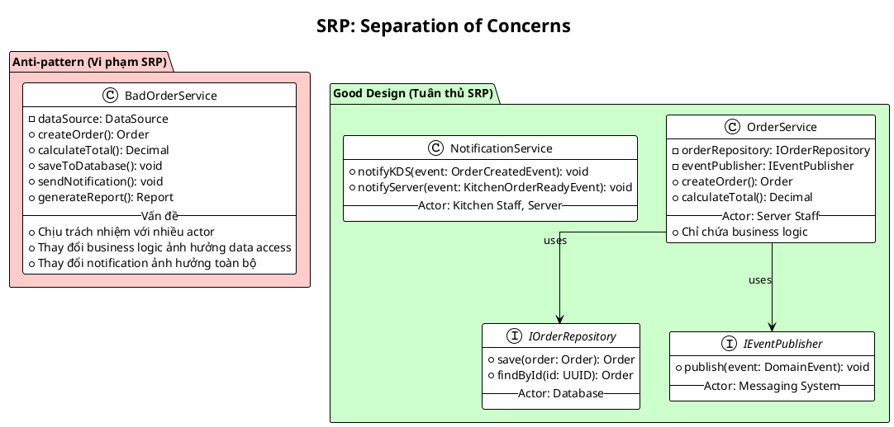

**C. Ví dụ cụ thể trong code**

```
// VI PHẠM SRP - Một class làm quá nhiều việc
class BadPaymentService {
    + processPayment()      // Business logic - cho Cashier
    + savePayment()         // Data access - cho Database
    + sendReceipt()         // Notification - cho Customer
    + generateReport()      // Reporting - cho Manager
}

// TUÂN THỦ SRP - Mỗi class một trách nhiệm
class PaymentService {
    + processPayment()  // Chỉ chứa business logic thanh toán
}

class PaymentRepository {
    + save()            // Chỉ chứa logic data access
}

class NotificationService {
    + sendReceipt()     // Chỉ chứa logic thông báo
}

class ReportingService {
    + generateReport()  // Chỉ chứa logic báo cáo
}
```

---

### 5.3. Open/Closed Principle (OCP)

#### 5.3.1. Định nghĩa

> **"A software artifact should be open for extension but closed for modification."**
> (Một artifact phần mềm nên mở cho việc mở rộng nhưng đóng cho việc sửa đổi.)

Theo slide, mục tiêu là có thể **thêm chức năng mới mà không cần sửa đổi code hiện có**.

#### 5.3.2. Áp dụng trong thiết kế IRMS

**A. Strategy Pattern cho Payment Processing**

Khi cần thêm phương thức thanh toán mới (ví dụ: Crypto), ta chỉ cần **thêm class mới** mà không sửa đổi `PaymentService`:

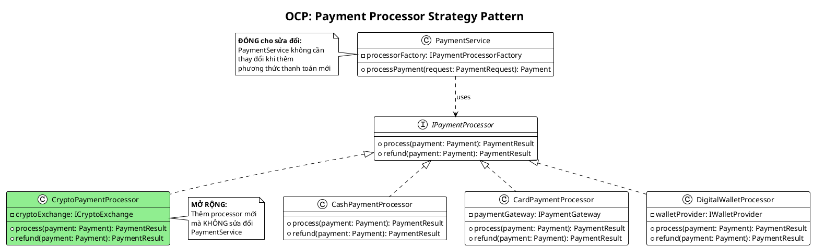

**B. Strategy Pattern cho Order Prioritization**

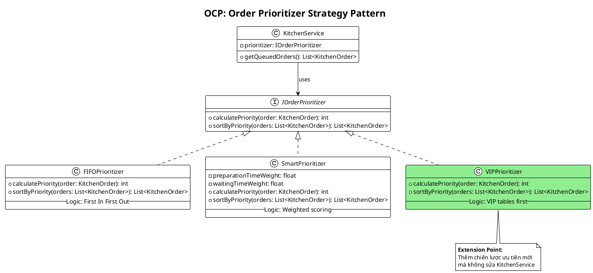

**C. Strategy Pattern cho Alert Service**

| Interface | Implementations | Extension Point |
|-----------|-----------------|-----------------|
| `IAlertService` | `EmailAlertService`, `PushAlertService` | Thêm `SMSAlertService`, `SlackAlertService` mà không sửa `InventoryService` |
| `INotificationService` | `NotificationService` | Thêm channels mới (SMS, Push, Slack) |

---

### 5.4. Liskov Substitution Principle (LSP)

#### 5.4.1. Định nghĩa

> **"Objects of a child class must be able to replace the parent class without changing the correctness of the program."**
> (Đối tượng của lớp con phải có khả năng thay thế lớp cha mà không làm thay đổi tính đúng đắn của chương trình.)

Theo slide, lớp con phải **duy trì hành vi của lớp cha** và không thay đổi logic khi thay thế.

#### 5.4.2. Áp dụng trong thiết kế IRMS

**A. Payment Processor tuân thủ LSP**

Tất cả các implementation của `IPaymentProcessor` đều có thể thay thế lẫn nhau mà không làm hỏng `PaymentService`:

```plantuml
@startuml LSP_Payment
!theme plain

title LSP: Payment Processors are Substitutable

interface IPaymentProcessor {
    + process(payment: Payment): PaymentResult
    + refund(payment: Payment): PaymentResult
}

note top of IPaymentProcessor
    **Contract đảm bảo:**
    1. process() trả về PaymentResult (success/fail)
    2. refund() trả về PaymentResult
    3. Không throw unexpected exceptions
    4. Không thay đổi state ngoài payment
end note

class CashPaymentProcessor {
    + process(payment: Payment): PaymentResult
    + refund(payment: Payment): PaymentResult
    -- Tuân thủ contract --
    -- Có thể thay thế bất kỳ processor nào --
}

class CardPaymentProcessor {
    + process(payment: Payment): PaymentResult
    + refund(payment: Payment): PaymentResult
    -- Tuân thủ contract --
    -- Thêm logic riêng nhưng không vi phạm --
}

class DigitalWalletProcessor {
    + process(payment: Payment): PaymentResult
    + refund(payment: Payment): PaymentResult
    -- Tuân thủ contract --
}

IPaymentProcessor <|.. CashPaymentProcessor
IPaymentProcessor <|.. CardPaymentProcessor
IPaymentProcessor <|.. DigitalWalletProcessor

class PaymentService {
    - processor: IPaymentProcessor
    + processPayment(request: PaymentRequest): Payment
}

note right of PaymentService
    PaymentService hoạt động đúng
    bất kể sử dụng processor nào:

    processor = new CashPaymentProcessor()
    processor = new CardPaymentProcessor()
    processor = new DigitalWalletProcessor()

    → Kết quả luôn nhất quán
end note

PaymentService --> IPaymentProcessor

@enduml
```

**B. Repository Pattern tuân thủ LSP**

```plantuml
@startuml LSP_Repository
!theme plain

title LSP: Repository Implementations

interface IOrderRepository {
    + save(order: Order): Order
    + findById(id: UUID): Order
    + findByStatus(status: OrderStatus): List<Order>
    + update(order: Order): Order
    + delete(id: UUID): void
}

class PostgresOrderRepository {
    + save(order: Order): Order
    + findById(id: UUID): Order
    + findByStatus(status: OrderStatus): List<Order>
    + update(order: Order): Order
    + delete(id: UUID): void
    -- Uses PostgreSQL --
}

class InMemoryOrderRepository {
    - orders: Map<UUID, Order>
    + save(order: Order): Order
    + findById(id: UUID): Order
    + findByStatus(status: OrderStatus): List<Order>
    + update(order: Order): Order
    + delete(id: UUID): void
    -- For unit testing --
}

class MongoOrderRepository #LightGreen {
    + save(order: Order): Order
    + findById(id: UUID): Order
    + findByStatus(status: OrderStatus): List<Order>
    + update(order: Order): Order
    + delete(id: UUID): void
    -- Uses MongoDB --
}

note bottom of InMemoryOrderRepository
    **LSP Compliance:**
    InMemoryOrderRepository có thể
    thay thế PostgresOrderRepository
    trong unit tests mà không
    ảnh hưởng OrderService
end note

IOrderRepository <|.. PostgresOrderRepository
IOrderRepository <|.. InMemoryOrderRepository
IOrderRepository <|.. MongoOrderRepository

@enduml
```

**C. Ví dụ vi phạm LSP và cách sửa**

```
// VI PHẠM LSP - Square không thể thay thế Rectangle
class Rectangle {
    width, height
    setWidth(w) { width = w }
    setHeight(h) { height = h }
    getArea() { return width * height }
}

class Square extends Rectangle {
    setWidth(w) { width = w; height = w }  // VI PHẠM!
    setHeight(h) { width = h; height = h } // VI PHẠM!
}

// Trong IRMS - TUÂN THỦ LSP
// Tất cả IPaymentProcessor implementations đều:
// 1. Nhận Payment input
// 2. Trả về PaymentResult
// 3. Không thay đổi contract
```

---

### 5.5. Interface Segregation Principle (ISP)

#### 5.5.1. Định nghĩa

> **"It is harmful to depend on modules that contain more than you need."**
> (Phụ thuộc vào các module chứa nhiều hơn những gì bạn cần là có hại.)

Theo slide, các interface nên **nhỏ và cụ thể**, class chỉ implement những method thực sự cần.

#### 5.5.2. Áp dụng trong thiết kế IRMS

**A. Tách biệt Service Interfaces**

Thay vì một interface `IRestaurantService` chứa tất cả, hệ thống tách thành các interface nhỏ:

```plantuml
@startuml ISP_Services
!theme plain

title ISP: Segregated Service Interfaces

package "Anti-pattern (Vi phạm ISP)" #FFCCCC {
    interface IBadRestaurantService {
        + createOrder(): Order
        + processPayment(): Payment
        + manageTable(): void
        + updateInventory(): void
        + generateReport(): void
        + manageUsers(): void
        -- Quá nhiều methods --
        -- Client phải implement tất cả --
    }

    class KitchenDisplay {
        -- Chỉ cần getOrders() --
        -- Nhưng phải biết về Payment, Inventory... --
    }

    KitchenDisplay ..> IBadRestaurantService
}

package "Good Design (Tuân thủ ISP)" #CCFFCC {
    interface IOrderService {
        + createOrder(): Order
        + getOrder(): Order
        + updateOrderStatus(): void
    }

    interface IPaymentService {
        + processPayment(): Payment
        + refundPayment(): Payment
    }

    interface ITableService {
        + getAvailableTables(): List<Table>
        + occupyTable(): void
    }

    interface IKitchenService {
        + getQueuedOrders(): List<KitchenOrder>
        + updateOrderStatus(): void
    }

    class KitchenDisplay {
        -- Chỉ cần IKitchenService --
        -- Không biết về Payment, Users... --
    }

    class POSTerminal {
        -- Cần IOrderService + IPaymentService --
        -- Không biết về Inventory, Reports... --
    }

    KitchenDisplay ..> IKitchenService : uses only
    POSTerminal ..> IOrderService : uses
    POSTerminal ..> IPaymentService : uses
}

@enduml
```

**B. Tách biệt Repository Interfaces**

```plantuml
@startuml ISP_Repository
!theme plain

title ISP: Segregated Repository Interfaces

interface IOrderReadRepository {
    + findById(id: UUID): Order
    + findByTableId(tableId: UUID): List<Order>
    + findByStatus(status: OrderStatus): List<Order>
}

interface IOrderWriteRepository {
    + save(order: Order): Order
    + update(order: Order): Order
    + delete(id: UUID): void
}

interface IOrderRepository {
}

note right of IOrderRepository
    Combines both interfaces
    for services that need
    full CRUD access
end note

IOrderRepository --|> IOrderReadRepository
IOrderRepository --|> IOrderWriteRepository

class ReportingService {
    - orderReadRepo: IOrderReadRepository
    -- Chỉ cần đọc dữ liệu --
    -- Không cần write access --
}

class OrderService {
    - orderRepo: IOrderRepository
    -- Cần cả read và write --
}

ReportingService ..> IOrderReadRepository : uses (read only)
OrderService ..> IOrderRepository : uses (full access)

@enduml
```

**C. Bảng tóm tắt tách biệt Interface**

| Fat Interface (Vi phạm) | Segregated Interfaces (Tuân thủ) | Client sử dụng |
|-------------------------|----------------------------------|----------------|
| `IRestaurantService` | `IOrderService`, `IPaymentService`, `ITableService`, `IKitchenService`, `IInventoryService` | Mỗi client chỉ dùng interface cần thiết |
| `IRepository` (full CRUD) | `IReadRepository`, `IWriteRepository` | ReportingService chỉ dùng Read |
| `INotification` (all channels) | `IEmailNotification`, `IPushNotification`, `ISMSNotification` | Từng service chọn channel cần |

---

### 5.6. Dependency Inversion Principle (DIP)

#### 5.6.1. Định nghĩa

> **"High-level modules should not depend on low-level modules. Both should depend on abstractions."**
> (Module cấp cao không nên phụ thuộc vào module cấp thấp. Cả hai nên phụ thuộc vào abstraction.)

> **"Abstractions should not depend upon details. Details should depend upon abstractions."**
> (Abstraction không nên phụ thuộc vào chi tiết. Chi tiết nên phụ thuộc vào abstraction.)

#### 5.6.2. Áp dụng trong thiết kế IRMS

**A. Service Layer phụ thuộc vào Abstractions**

```plantuml
@startuml DIP_Overview
!theme plain
skinparam linetype ortho

title DIP: Dependency Inversion in IRMS

package "High-Level Module" #LightYellow {
    class OrderService {
        - orderRepository: IOrderRepository
        - menuService: IMenuService
        - eventPublisher: IEventPublisher
        + createOrder(): Order
    }

    note right of OrderService
        **High-level policy:**
        Order business logic

        Phụ thuộc vào ABSTRACTIONS,
        không phụ thuộc vào implementations
    end note
}

package "Abstractions" #LightGreen {
    interface IOrderRepository {
        + save(order: Order): Order
        + findById(id: UUID): Order
    }

    interface IMenuService {
        + getMenuItem(id: UUID): MenuItem
    }

    interface IEventPublisher {
        + publish(event: DomainEvent): void
    }

    note bottom of IOrderRepository
        **Both depend on abstractions:**
        - OrderService depends on IOrderRepository
        - PostgresOrderRepository depends on IOrderRepository
    end note
}

package "Low-Level Modules" #LightPink {
    class PostgresOrderRepository {
        - dataSource: DataSource
        + save(order: Order): Order
        + findById(id: UUID): Order
    }

    class MenuServiceImpl {
        + getMenuItem(id: UUID): MenuItem
    }

    class RabbitMQEventPublisher {
        - connection: RabbitMQConnection
        + publish(event: DomainEvent): void
    }

    note right of PostgresOrderRepository
        **Low-level details:**
        Database implementation

        Phụ thuộc vào ABSTRACTION,
        không biết về OrderService
    end note
}

' Dependencies flow TOWARDS abstractions
OrderService --> IOrderRepository
OrderService --> IMenuService
OrderService --> IEventPublisher

PostgresOrderRepository ..|> IOrderRepository : implements
MenuServiceImpl ..|> IMenuService : implements
RabbitMQEventPublisher ..|> IEventPublisher : implements

@enduml
```

**B. Factory Pattern để quản lý Dependencies**

```plantuml
@startuml DIP_Factory
!theme plain

title DIP: Factory Pattern for Dependency Management

interface IPaymentProcessorFactory {
    + createProcessor(method: PaymentMethod): IPaymentProcessor
}

class PaymentProcessorFactory {
    + createProcessor(method: PaymentMethod): IPaymentProcessor
}

note right of PaymentProcessorFactory
    **Abstract Factory:**
    Tạo concrete objects mà
    không để PaymentService
    phụ thuộc trực tiếp vào
    concrete classes
end note

interface IPaymentProcessor {
    + process(payment: Payment): PaymentResult
}

class CashPaymentProcessor
class CardPaymentProcessor
class DigitalWalletProcessor

class PaymentService {
    - processorFactory: IPaymentProcessorFactory
    + processPayment(request: PaymentRequest): Payment
}

note left of PaymentService
    PaymentService không biết về:
    - CashPaymentProcessor
    - CardPaymentProcessor
    - DigitalWalletProcessor

    Chỉ biết về abstractions:
    - IPaymentProcessorFactory
    - IPaymentProcessor
end note

IPaymentProcessorFactory <|.. PaymentProcessorFactory
IPaymentProcessor <|.. CashPaymentProcessor
IPaymentProcessor <|.. CardPaymentProcessor
IPaymentProcessor <|.. DigitalWalletProcessor

PaymentService --> IPaymentProcessorFactory : uses
PaymentProcessorFactory ..> IPaymentProcessor : creates

@enduml
```

**C. Dependency Injection trong các Services**

```plantuml
@startuml DIP_Injection
!theme plain

title DIP: Constructor Injection

class OrderService {
    - orderRepository: IOrderRepository
    - menuService: IMenuService
    - inventoryService: IInventoryService
    - eventPublisher: IEventPublisher
    ..
    + OrderService(
        orderRepository: IOrderRepository,
        menuService: IMenuService,
        inventoryService: IInventoryService,
        eventPublisher: IEventPublisher
    )
    ..
    + createOrder(): Order
}

note right of OrderService
    **Constructor Injection:**

    Dependencies được inject
    qua constructor dưới dạng
    interfaces, không phải
    concrete classes

    → Dễ test với mock objects
    → Dễ thay đổi implementation
end note

interface IOrderRepository
interface IMenuService
interface IInventoryService
interface IEventPublisher

OrderService --> IOrderRepository
OrderService --> IMenuService
OrderService --> IInventoryService
OrderService --> IEventPublisher

@enduml
```

**D. Bảng tóm tắt DIP trong IRMS**

| High-Level Module | Abstraction (Interface) | Low-Level Module (Implementation) |
|-------------------|------------------------|-----------------------------------|
| `OrderService` | `IOrderRepository` | `PostgresOrderRepository`, `InMemoryOrderRepository` |
| `OrderService` | `IEventPublisher` | `RabbitMQEventPublisher`, `KafkaEventPublisher` |
| `PaymentService` | `IPaymentProcessor` | `CashPaymentProcessor`, `CardPaymentProcessor` |
| `PaymentService` | `IPaymentGateway` | `StripeGateway`, `VNPayGateway` |
| `KitchenService` | `IOrderPrioritizer` | `FIFOPrioritizer`, `SmartPrioritizer` |
| `InventoryService` | `IAlertService` | `EmailAlertService`, `PushAlertService` |
| `AuthService` | `ITokenProvider` | `JWTTokenProvider`, `OAuthTokenProvider` |

---

### 5.7. Tổng kết áp dụng SOLID

```plantuml
@startuml SOLID_Summary
!theme plain

title Tổng kết: SOLID Principles trong IRMS

rectangle "**S**ingle Responsibility Principle" as SRP #FFE6CC {
    note as N1
        **Áp dụng:**
        - Mỗi Service class chỉ có 1 trách nhiệm
        - OrderService ≠ PaymentService ≠ KitchenService
        - Repository tách biệt khỏi Service
        - Event publishing tách biệt khỏi business logic
    end note
}

rectangle "**O**pen/Closed Principle" as OCP #E6FFE6 {
    note as N2
        **Áp dụng:**
        - Strategy Pattern: IPaymentProcessor, IOrderPrioritizer
        - Thêm processor mới không sửa PaymentService
        - Thêm alert channel mới không sửa InventoryService
        - Plugin architecture cho extensions
    end note
}

rectangle "**L**iskov Substitution Principle" as LSP #E6E6FF {
    note as N3
        **Áp dụng:**
        - Mọi IPaymentProcessor đều substitutable
        - InMemoryRepository thay thế PostgresRepository trong tests
        - Mọi implementation tuân thủ contract của interface
    end note
}

rectangle "**I**nterface Segregation Principle" as ISP #FFE6FF {
    note as N4
        **Áp dụng:**
        - Interfaces nhỏ, cụ thể theo domain
        - IOrderService, IPaymentService, IKitchenService riêng biệt
        - IReadRepository vs IWriteRepository
        - Client chỉ phụ thuộc interface cần thiết
    end note
}

rectangle "**D**ependency Inversion Principle" as DIP #FFFFE6 {
    note as N5
        **Áp dụng:**
        - Services phụ thuộc vào interfaces, không concrete classes
        - Constructor Injection cho dependencies
        - Factory Pattern để tạo objects
        - High-level modules không biết về low-level details
    end note
}

SRP -[hidden]down- OCP
OCP -[hidden]down- LSP
LSP -[hidden]down- ISP
ISP -[hidden]down- DIP

@enduml
```

| Nguyên lý | Classes/Interfaces áp dụng | Lợi ích đạt được |
|-----------|---------------------------|------------------|
| **SRP** | `OrderService`, `PaymentService`, `KitchenService`, `*Repository` | Dễ maintain, test, và thay đổi độc lập |
| **OCP** | `IPaymentProcessor`, `IOrderPrioritizer`, `IAlertService` | Mở rộng tính năng mà không sửa code hiện có |
| **LSP** | Tất cả interface implementations | Đảm bảo tính nhất quán, dễ test với mocks |
| **ISP** | `IOrderService`, `IPaymentService`, `IReadRepository` | Giảm coupling, client chỉ phụ thuộc những gì cần |
| **DIP** | Constructor injection trong tất cả Services | Loose coupling, dễ thay đổi implementation |

---

---

## 6. Đánh giá khả năng mở rộng trong tương lai (Future Extensibility)

### 6.1. Giới thiệu

Một trong những tiêu chí quan trọng nhất để đánh giá chất lượng kiến trúc phần mềm là **khả năng mở rộng** (Extensibility). Theo các nguyên lý SOLID đã trình bày, đặc biệt là **Open/Closed Principle (OCP)**, hệ thống tốt phải "mở cho việc mở rộng nhưng đóng cho việc sửa đổi".

Phần này đánh giá khả năng mở rộng của kiến trúc IRMS qua các kịch bản thực tế có thể xảy ra trong tương lai.

### 6.2. Kịch bản 1: Tích hợp hệ thống Delivery (Giao hàng)

#### 6.2.1. Mô tả kịch bản

Nhà hàng muốn mở rộng kinh doanh bằng cách cung cấp dịch vụ giao hàng (Delivery). Điều này yêu cầu:
- Tích hợp với các nền tảng giao hàng (GrabFood, ShopeeFood, GoFood)
- Quản lý đơn hàng delivery riêng biệt với đơn dine-in
- Theo dõi trạng thái giao hàng
- Tính phí giao hàng và áp dụng khuyến mãi riêng

#### 6.2.2. Cách kiến trúc hiện tại đáp ứng

```plantuml
@startuml Extensibility_Delivery
!theme plain
skinparam linetype ortho

title Kịch bản 1: Mở rộng Delivery Service

package "Existing Architecture" #LightGray {
    interface IOrderService {
        + createOrder(): Order
        + getOrder(): Order
        + updateOrderStatus(): Order
    }

    class OrderService {
        - orderRepository: IOrderRepository
    }

    interface IPaymentProcessor {
        + process(): PaymentResult
    }
}

package "New Extension" #LightGreen {

    class DeliveryService <<New Service>> {
        - deliveryRepository: IDeliveryRepository
        - orderService: IOrderService
        - driverService: IDriverService
        + createDeliveryOrder(): DeliveryOrder
        + assignDriver(): void
        + trackDelivery(): DeliveryStatus
        + calculateDeliveryFee(): Decimal
    }

    interface IDeliveryPartner <<Strategy>> {
        + sendOrder(order: DeliveryOrder): void
        + getStatus(orderId: String): DeliveryStatus
        + cancelOrder(orderId: String): void
    }

    class GrabFoodAdapter {
        + sendOrder(): void
        + getStatus(): DeliveryStatus
    }

    class ShopeeFoodAdapter {
        + sendOrder(): void
        + getStatus(): DeliveryStatus
    }

    class InHouseDeliveryAdapter {
        + sendOrder(): void
        + getStatus(): DeliveryStatus
    }

    class DeliveryOrder <<New Entity>> {
        - orderId: UUID
        - deliveryAddress: Address
        - deliveryFee: Decimal
        - estimatedTime: DateTime
        - driverId: UUID
        - status: DeliveryStatus
    }
}

IDeliveryPartner <|.. GrabFoodAdapter
IDeliveryPartner <|.. ShopeeFoodAdapter
IDeliveryPartner <|.. InHouseDeliveryAdapter

DeliveryService --> IOrderService : uses existing
DeliveryService --> IDeliveryPartner : uses (OCP)

note right of DeliveryService
    **Áp dụng OCP:**
    - Thêm DeliveryService MỚI
    - KHÔNG sửa OrderService hiện có
    - Strategy Pattern cho delivery partners
end note

note bottom of IDeliveryPartner
    **Áp dụng DIP:**
    - DeliveryService phụ thuộc interface
    - Dễ thêm partner mới (Baemin, etc.)
end note

@enduml
```

#### 6.2.3. Điều chỉnh cần thiết

| Thành phần | Thay đổi | Nguyên lý áp dụng |
|------------|----------|-------------------|
| **Order Module** | Không thay đổi - DeliveryService sử dụng qua interface | DIP, ISP |
| **Delivery Service** | Thêm service MỚI | OCP - mở rộng không sửa đổi |
| **IDeliveryPartner** | Interface mới với Strategy Pattern | OCP, DIP |
| **Database** | Thêm bảng `delivery_orders`, `drivers` | Không ảnh hưởng bảng hiện có |
| **API Gateway** | Thêm routes `/api/delivery/*` | Cấu hình, không sửa code |

**Kết luận**: Kiến trúc hiện tại **đáp ứng tốt** kịch bản này nhờ:
- Service-Based Architecture cho phép thêm service mới độc lập
- Interface Segregation giúp DeliveryService chỉ phụ thuộc những gì cần
- Strategy Pattern sẵn sàng cho việc tích hợp nhiều delivery partners

---

### 6.3. Kịch bản 2: Mở rộng thành chuỗi nhà hàng (Multi-Branch)

#### 6.3.1. Mô tả kịch bản

Nhà hàng phát triển thành chuỗi với nhiều chi nhánh. Yêu cầu:
- Quản lý tập trung thực đơn, giá cả, khuyến mãi
- Mỗi chi nhánh có tồn kho, nhân viên, báo cáo riêng
- Dashboard tổng hợp cho cấp quản lý chuỗi
- Hỗ trợ scale horizontal để đáp ứng tải cao hơn

#### 6.3.2. Cách kiến trúc hiện tại đáp ứng

```plantuml
@startuml Extensibility_MultiBranch
!theme plain
skinparam linetype ortho

title Kịch bản 2: Mở rộng Multi-Branch Architecture

package "Current Single-Branch" #LightGray {
    component [Order Service] as OS
    component [Kitchen Service] as KS
    component [Payment Service] as PS
    component [Inventory Service] as IS
    database "Database" as DB
}

package "Multi-Branch Extension" #LightGreen {

    package "Central Management" {
        component [Menu Service\n(Centralized)] as CMS #Yellow
        component [Promotion Service\n(Centralized)] as CPS #Yellow
        component [Chain Analytics\n(New)] as CA #Green
        database "Central DB\n(Menu, Promo)" as CDB
    }

    package "Branch 1" {
        component [Order Service\nBranch 1] as OS1
        component [Kitchen Service\nBranch 1] as KS1
        component [Inventory Service\nBranch 1] as IS1
        database "Branch 1 DB" as DB1
    }

    package "Branch 2" {
        component [Order Service\nBranch 2] as OS2
        component [Kitchen Service\nBranch 2] as KS2
        component [Inventory Service\nBranch 2] as IS2
        database "Branch 2 DB" as DB2
    }

    package "Branch N" {
        component [Order Service\nBranch N] as OSN
        component [...] as etc
    }
}

' Relationships
OS1 --> CMS : get menu
OS2 --> CMS : get menu
OS1 --> DB1 : orders
OS2 --> DB2 : orders

CA --> DB1 : aggregate
CA --> DB2 : aggregate

note right of CMS
    **Centralized Services:**
    - Menu dùng chung
    - Pricing dùng chung
    - Promotions dùng chung
end note

note bottom of OS1
    **Branch-Specific:**
    - Orders
    - Kitchen workflow
    - Inventory
    - Local staff
end note

@enduml
```

#### 6.3.3. Chiến lược Scale Horizontal

```plantuml
@startuml Extensibility_Scale
!theme plain

title Kịch bản 2: Horizontal Scaling Strategy

node "Load Balancer" as LB #LightBlue

node "Service Instance 1" as S1 {
    component [Order Service] as OS1
}

node "Service Instance 2" as S2 {
    component [Order Service] as OS2
}

node "Service Instance N" as SN {
    component [Order Service] as OSN
}

database "PostgreSQL\nPrimary" as PG_P
database "PostgreSQL\nReplica 1" as PG_R1
database "PostgreSQL\nReplica 2" as PG_R2

database "Redis Cluster" as Redis

LB --> S1
LB --> S2
LB --> SN

S1 --> PG_P : write
S2 --> PG_P : write
S1 --> PG_R1 : read
S2 --> PG_R2 : read

S1 --> Redis : cache
S2 --> Redis : cache

note right of LB
    **Stateless Services:**
    - Mỗi service instance độc lập
    - Session/state lưu trong Redis
    - Có thể scale theo demand
end note

note bottom of PG_P
    **Database Scaling:**
    - Primary cho writes
    - Replicas cho reads
    - Connection pooling
end note

@enduml
```

#### 6.3.4. Điều chỉnh cần thiết

| Thành phần | Thay đổi | Mức độ |
|------------|----------|--------|
| **Domain Entities** | Thêm `branchId` vào Order, Inventory, User | Nhỏ |
| **Database** | Database sharding hoặc multi-tenant | Trung bình |
| **Caching** | Upgrade Redis standalone → Redis Cluster | Nhỏ |
| **Menu Service** | Tách thành Centralized service | Trung bình |
| **Reporting Service** | Thêm Chain Analytics module | Mở rộng (OCP) |
| **Infrastructure** | Kubernetes cho orchestration | Hạ tầng |

**Kết luận**: Kiến trúc hiện tại **cần điều chỉnh vừa phải**:
- Ưu điểm: Service-Based Architecture hỗ trợ tốt việc scale từng service
- Cần thêm: Multi-tenancy support, Database sharding strategy
- Stateless services giúp horizontal scaling dễ dàng

---

### 6.4. Kịch bản 3: Tích hợp AI/Machine Learning

#### 6.4.1. Mô tả kịch bản

Tích hợp các tính năng AI để nâng cao trải nghiệm và hiệu quả:
- **Dự đoán nhu cầu tồn kho** (Inventory Forecasting)
- **Gợi ý món ăn thông minh** (Smart Recommendations)
- **Tối ưu hóa quy trình bếp** (Kitchen Optimization)
- **Phân tích sentiment từ feedback** (Customer Feedback Analysis)

#### 6.4.2. Cách kiến trúc hiện tại đáp ứng

```plantuml
@startuml Extensibility_AI
!theme plain
skinparam linetype ortho

title Kịch bản 3: AI/ML Integration

package "Existing Services" #LightGray {
    component [Order Service] as OS
    component [Inventory Service] as IS
    component [Kitchen Service] as KS
    component [Menu Service] as MS

    interface IOrderRepository
    interface IInventoryRepository
}

package "New AI Services" #LightGreen {

    component [AI Gateway\n(New)] as AIG #Yellow

    package "ML Models" {
        component [Inventory\nForecaster] as IF
        component [Recommendation\nEngine] as RE
        component [Kitchen\nOptimizer] as KO
        component [Sentiment\nAnalyzer] as SA
    }

    database "ML Data Lake" as DL
    database "Model Registry" as MR
}

package "Data Pipeline" #LightBlue {
    queue "Event Stream\n(Kafka)" as ES
    component [ETL Service] as ETL
}

' Data flow
OS --> ES : order events
IS --> ES : inventory events
KS --> ES : kitchen events

ES --> ETL
ETL --> DL

IF --> DL : training data
RE --> DL : training data

' Service integration
OS --> AIG : get recommendations
IS --> AIG : get forecast
KS --> AIG : get optimization

AIG --> IF
AIG --> RE
AIG --> KO
AIG --> SA

note right of AIG
    **AI Gateway Pattern:**
    - Single entry point cho AI services
    - Load balancing giữa models
    - Caching predictions
    - Fallback khi model unavailable
end note

note bottom of IF
    **Áp dụng OCP:**
    - AI services là EXTENSION
    - Không sửa đổi services hiện có
    - Services hiện có publish events
    - AI services consume và analyze
end note

@enduml
```

#### 6.4.3. Chi tiết từng AI Feature

```plantuml
@startuml Extensibility_AI_Details
!theme plain

title AI Features Integration Details

package "1. Inventory Forecasting" #E6FFE6 {
    interface IInventoryAlertService {
        + sendLowStockAlert(): void
        + sendReorderAlert(): void
    }

    class AIInventoryAlertService <<New>> {
        - forecastModel: IForecastModel
        + sendLowStockAlert(): void
        + sendReorderAlert(): void
        + predictDemand(days: int): Forecast
        + suggestReorderQuantity(): Decimal
    }

    note bottom of AIInventoryAlertService
        **Áp dụng LSP:**
        AIInventoryAlertService có thể
        thay thế basic alert service
        + thêm AI predictions
    end note
}

package "2. Smart Recommendations" #E6E6FF {
    interface IRecommendationService <<New>> {
        + getRecommendations(context: OrderContext): List<MenuItem>
        + getUpsellItems(currentItems: List<MenuItem>): List<MenuItem>
    }

    class MLRecommendationService {
        - model: IRecommendationModel
        + getRecommendations(): List<MenuItem>
        + getUpsellItems(): List<MenuItem>
    }

    class RuleBasedRecommendation {
        + getRecommendations(): List<MenuItem>
        + getUpsellItems(): List<MenuItem>
    }

    IRecommendationService <|.. MLRecommendationService
    IRecommendationService <|.. RuleBasedRecommendation

    note bottom of IRecommendationService
        **Áp dụng OCP + DIP:**
        - OrderService gọi interface
        - Có thể swap ML ↔ Rule-based
        - Fallback khi ML unavailable
    end note
}

package "3. Kitchen Optimization" #FFE6E6 {
    interface IOrderPrioritizer {
        + calculatePriority(): int
        + sortByPriority(): List<KitchenOrder>
    }

    class AIKitchenOptimizer <<New>> {
        - mlModel: IOptimizationModel
        - historicalData: IDataRepository
        + calculatePriority(): int
        + sortByPriority(): List<KitchenOrder>
        + predictPrepTime(): int
        + suggestStationAssignment(): Station
    }

    IOrderPrioritizer <|.. AIKitchenOptimizer

    note bottom of AIKitchenOptimizer
        **Áp dụng LSP:**
        AIKitchenOptimizer implements
        IOrderPrioritizer interface
        → Thay thế FIFO/Smart prioritizer
    end note
}

@enduml
```

#### 6.4.4. Điều chỉnh cần thiết

| Thành phần | Thay đổi | Nguyên lý áp dụng |
|------------|----------|-------------------|
| **Event Publishing** | Services publish events tới Kafka | Đã có IEventPublisher (DIP) |
| **Data Pipeline** | Thêm ETL service và Data Lake | Mở rộng hạ tầng |
| **AI Gateway** | Service mới điều phối ML models | OCP - thêm không sửa |
| **IOrderPrioritizer** | Thêm `AIKitchenOptimizer` implementation | LSP - substitutable |
| **IAlertService** | Thêm `AIInventoryAlertService` implementation | LSP - substitutable |
| **Menu Service** | Tích hợp với `IRecommendationService` | DIP - phụ thuộc interface |

**Kết luận**: Kiến trúc hiện tại **đáp ứng rất tốt** nhờ:
- Interface-based design (DIP) cho phép swap implementations
- Strategy Pattern sẵn có cho Prioritizer, AlertService
- Event-driven elements đã có sẵn cho data streaming
- Chỉ cần thêm AI services mới, không sửa services hiện có (OCP)

---

### 6.5. Kịch bản 4: Loyalty Program & Customer Engagement

#### 6.5.1. Mô tả kịch bản

Triển khai chương trình khách hàng thân thiết:
- Tích điểm khi mua hàng
- Đổi điểm lấy voucher/món miễn phí
- Phân hạng khách hàng (Silver, Gold, Platinum)
- Personalized promotions

#### 6.5.2. Cách kiến trúc hiện tại đáp ứng

```plantuml
@startuml Extensibility_Loyalty
!theme plain
skinparam linetype ortho

title Kịch bản 4: Loyalty Program Extension

package "Existing Payment Flow" #LightGray {
    class PaymentService {
        - eventPublisher: IEventPublisher
        + processPayment(): Payment
    }

    interface IEventPublisher {
        + publish(event: DomainEvent): void
    }

    class PaymentCompletedEvent {
        - paymentId: UUID
        - orderId: UUID
        - amount: Decimal
        - customerId: UUID
    }
}

package "New Loyalty Module" #LightGreen {

    class LoyaltyService <<New Service>> {
        - loyaltyRepository: ILoyaltyRepository
        - tierCalculator: ITierCalculator
        - rewardEngine: IRewardEngine
        + earnPoints(customerId: UUID, amount: Decimal): void
        + redeemPoints(customerId: UUID, points: int): Voucher
        + getCustomerTier(customerId: UUID): Tier
        + getAvailableRewards(customerId: UUID): List<Reward>
    }

    class LoyaltyEventHandler <<Event Subscriber>> {
        - loyaltyService: LoyaltyService
        + handle(event: PaymentCompletedEvent): void
    }

    class Customer <<New Entity>> {
        - name: String
        - phone: String
        - email: String
        - points: int
        - tier: Tier
        - totalSpent: Decimal
    }

    enum Tier {
        BRONZE
        SILVER
        GOLD
        PLATINUM
    }

    interface ITierCalculator {
        + calculateTier(totalSpent: Decimal): Tier
        + getPointMultiplier(tier: Tier): float
    }

    class StandardTierCalculator {
        + calculateTier(): Tier
        + getPointMultiplier(): float
    }
}

PaymentService --> IEventPublisher : publishes
IEventPublisher ..> PaymentCompletedEvent

LoyaltyEventHandler --> PaymentCompletedEvent : subscribes
LoyaltyEventHandler --> LoyaltyService : calls

ITierCalculator <|.. StandardTierCalculator
LoyaltyService --> ITierCalculator

note right of LoyaltyEventHandler
    **Event-Driven Integration:**
    - PaymentService KHÔNG biết về Loyalty
    - Loyalty subscribe events
    - Loose coupling hoàn toàn
end note

note bottom of ITierCalculator
    **Áp dụng OCP:**
    - Dễ thêm tier rules mới
    - VIPTierCalculator cho special cases
end note

@enduml
```

#### 6.5.3. Điều chỉnh cần thiết

| Thành phần | Thay đổi | Mức độ |
|------------|----------|--------|
| **Payment Service** | Không thay đổi - đã publish events | Không |
| **Loyalty Service** | Thêm service MỚI hoàn toàn | OCP |
| **Customer Entity** | Thêm domain entity mới | Mở rộng |
| **Database** | Thêm bảng `customers`, `loyalty_transactions`, `rewards` | Schema mới |
| **Frontend** | Thêm UI cho loyalty (points, rewards) | Mở rộng |

**Kết luận**: Kiến trúc **đáp ứng xuất sắc** nhờ:
- Event-driven architecture sẵn có
- PaymentService không cần sửa đổi
- Loyalty module hoàn toàn độc lập

---

### 6.6. Tổng kết khả năng mở rộng

#### 6.6.1. Ma trận đánh giá

| Kịch bản | Độ phức tạp | Sửa code hiện có | SOLID áp dụng | Đánh giá |
|----------|-------------|------------------|---------------|----------|
| **Delivery Integration** | Trung bình | Không | OCP, DIP, Strategy | ⭐⭐⭐⭐⭐ |
| **Multi-Branch** | Cao | Một phần (thêm branchId) | SRP, DIP | ⭐⭐⭐⭐ |
| **AI/ML Integration** | Cao | Không | OCP, LSP, DIP | ⭐⭐⭐⭐⭐ |
| **Loyalty Program** | Thấp | Không | OCP, Event-driven | ⭐⭐⭐⭐⭐ |

#### 6.6.2. Điểm mạnh của kiến trúc

```plantuml
@startuml Extensibility_Summary
!theme plain

title Tổng kết: Điểm mạnh về Extensibility

rectangle "Service-Based Architecture" as SBA #LightBlue {
    note as N1
        ✓ Services độc lập, deploy riêng
        ✓ Thêm service mới không ảnh hưởng hiện có
        ✓ Scale từng service theo nhu cầu
    end note
}

rectangle "Interface-Driven Design (DIP)" as IDD #LightGreen {
    note as N2
        ✓ Services phụ thuộc abstractions
        ✓ Dễ swap implementations
        ✓ Hỗ trợ testing với mocks
    end note
}

rectangle "Strategy Pattern (OCP)" as SP #LightYellow {
    note as N3
        ✓ IPaymentProcessor → thêm payment methods
        ✓ IOrderPrioritizer → thêm algorithms
        ✓ IAlertService → thêm channels
    end note
}

rectangle "Event-Driven Elements" as EDE #LightPink {
    note as N4
        ✓ Loose coupling giữa modules
        ✓ Async processing
        ✓ Dễ thêm event subscribers
    end note
}

rectangle "Domain Separation (SRP)" as DS #LightCyan {
    note as N5
        ✓ Mỗi service một domain
        ✓ Clear boundaries
        ✓ Team independence
    end note
}

SBA -[hidden]down- IDD
IDD -[hidden]down- SP
SP -[hidden]down- EDE
EDE -[hidden]down- DS

@enduml
```

#### 6.6.3. Khuyến nghị cho tương lai

| Khía cạnh | Khuyến nghị | Ưu tiên |
|-----------|-------------|---------|
| **API Versioning** | Implement API versioning (v1, v2) để backward compatibility | Cao |
| **Feature Flags** | Sử dụng feature flags để gradual rollout | Trung bình |
| **Contract Testing** | Consumer-driven contract testing giữa services | Cao |
| **Event Schema Registry** | Schema registry cho domain events (Avro/Protobuf) | Trung bình |
| **Monitoring** | Distributed tracing (Jaeger/Zipkin) khi scale | Cao |
| **Documentation** | OpenAPI specs cho tất cả services | Cao |

#### 6.6.4. Kết luận

Kiến trúc Service-Based Architecture được thiết kế cho IRMS có **khả năng mở rộng tốt** nhờ việc áp dụng nhất quán các nguyên lý SOLID:

1. **SRP** đảm bảo các service có trách nhiệm rõ ràng, dễ thay đổi độc lập
2. **OCP** thông qua Strategy Pattern cho phép thêm tính năng mà không sửa code hiện có
3. **LSP** đảm bảo các implementation có thể thay thế lẫn nhau
4. **ISP** giúp các service chỉ phụ thuộc những gì cần thiết
5. **DIP** tạo loose coupling thông qua dependency injection

Với thiết kế này, IRMS sẵn sàng đáp ứng các yêu cầu mở rộng trong tương lai với **chi phí thay đổi tối thiểu** và **rủi ro thấp** cho hệ thống hiện có.

---

*[Kết thúc Task 1: Software Architecture Design]*

